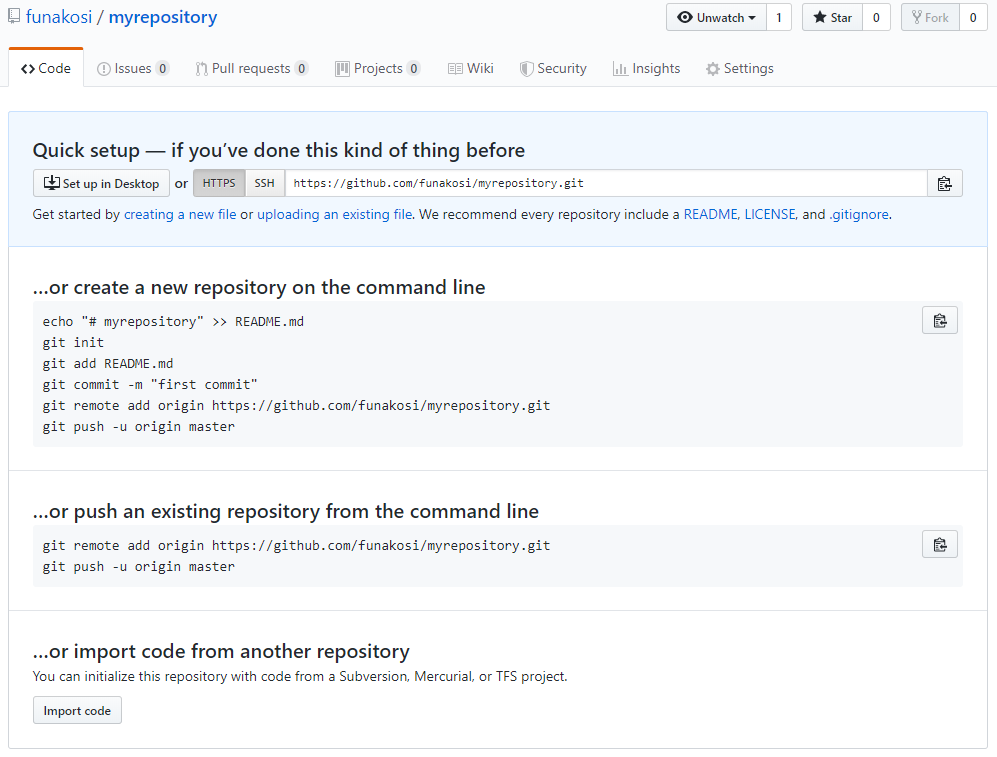
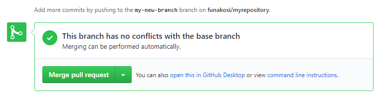
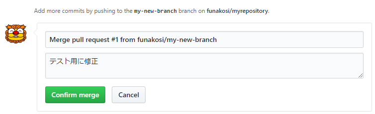
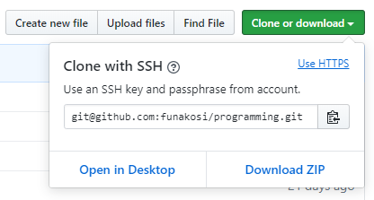

# GitとGitHub入門

この文書はGitとGitHubの入門用の資料である。基本的には「[An Intro to Git and GitHub for Beginners(Tutorial)](https://product.hubspot.com/blog/git-and-github-tutorial-for-beginners)」の記事の流れで記載しくが、必要に応じて使用するソフトや環境は変更予定。


## 前提条件

- 使用するOS：WIndows10、WSL（[こちら](https://github.com/funakosi/programming/tree/master/linux)やその他サイトを参考にWSL環境を導入しておく事）
  上のリンクの通りに進めるとWSLのホームディレクトリは `C:\home` になる
- Git環境：WSL(Ubuntu18.04)上のTerminal
- Gitに関する操作は基本的にコマンドベースですすめていく
- ファイル編集等の作業はvi 又はWindows上からエディタ等を使用して編集する
- コマンド操作が不慣れなら [ここ](https://mac.appstorm.net/how-to/utilities-how-to/how-to-use-terminal-the-basics/) のチュートリアル等である程度慣れておく事
- ここではコマンド入力には [ConEmu](https://conemu.github.io/)を使用する
  コマンド入力はコマンドプロンプト等、各自好みのツールを使用してもよい


## Step0: Git環境の構築

- Gitのインストール：WSL上にインストール済のUbuntuにデフォルトでインストールされているので特に追加で行う作業はない

- GitHubアカウントの作成：[こちら](https://github.com/join)からアカウントの作成を行う
  Privateリポジトリは制限付きで無料になっている（[参照](https://qiita.com/wagase/items/4ed3e9998848cfa733be))

- 初期設定：リポジトリ毎にユーザ名は切り替えていきたいので、[こちら](https://qiita.com/uasi/items/a340bb487ec07caac799)を参考に設定する。

  ```bash
  $ git config --global user.useConfigOnly true  #これが設定用コマンド
  $ git config --global --unset user.name        #グローバルに登録されていたら削除
  $ git config --global --unset user.email       #〃
  
  $ cd /path/to/my_repo                          #リポジトリに移動
  $ git config user.name "My Name"               #ユーザ名設定
  $ git config user.email "MY EMAIL ADDRESS"     #メールアドレス設定
  ```

  

## Step1: ローカルリポジトリを作成

- WSLの起動
  メニューからUbuntuのターミナルを起動するか、コマンドプロンプトを起動し `$ bash`とすることでも起動可能。
  
- ホームディレクトリにフォルダ（my_project）を作成し、そこにローカルリポジトリを作成
  
  ```bash
  $ bash #Ubuntu起動
  $ cd   #ホームディレクトリへ移動
  $ mkdir my_project #フォルダ作成
  $ cd myproject #作成したフォルダに移動
  $ git init
  Initialized empty Git repository in /mnt/c/home/my_project/.git/
  ```


## Step2: リポジトリに新しいファイルを追加

- touchコマンドで新しいファイルを追加

  ```bash
  $ touch sample.txt
  $ ls
  sample.txt
  ```

- `git status`で現状の確認を行う

  ```bash
  $ git status
  On branch master
  
  No commits yet
  
  Untracked files:
    (use "git add <file>..." to include in what will be committed)
  
          sample.txt
  
  nothing added to commit but untracked files present (use "git add" to track)
  ```

- `staging` と `commit`の説明
  git で分かりにくい `staging` と `commit`という２つの状態の説明。gitのリポジトリにファイルを追加しても自動的にそのファイルがgitの管理対象とはならない。まずは `staging`環境にファイルを追加し、その後 `commit`状態にする必要がある。一度 `commit`状態となり管理対象となったファイルは、以降あらゆるポイントの状態へ復元することができる。（[ここ](https://kray.jp/blog/expound-git-add/)や[ここ](https://techacademy.jp/magazine/10168)も参考にすること）

## Step3: 作成したファイルをステージング環境に追加

- Step2で作成したファイルをステージング環境に追加する

  ```bash
  $ git add .
  $ git status
  On branch master
  
  No commits yet
  
  Changes to be committed:
    (use "git rm --cached <file>..." to unstage)
  
          new file:   sample.txt
  ```


## Step4: コミット

- 対象のファイルをコミットする
  コミットするときには短めのコメントを加えるのが通例（以下コマンドの -m の後）

  ```bash
  $ git commit -m "新しいファイルを追加"
  
  *** Please tell me who you are.
  
  Run
  
    git config --global user.email "you@example.com"
    git config --global user.name "Your Name"
  
  to set your account's default identity.
  Omit --global to set the identity only in this repository.
  
  fatal: no email was given and auto-detection is disabled
  ```

  どうやらエラーになっている。コミット時に必要なユーザ名とメルアドの情報が登録されていない。
  必要な情報はグローバルに登録するしてもよいが、ここではリポジトリ毎に情報を登録する方針で作業を行うので、上のメッセージに書かれているやり方（--global）とは別の方法を試す。

  ```bash
  $ git config user.name "My Name"               #ユーザ名設定
  $ git config user.email "MY EMAIL ADDRESS"     #メールアドレス設定
  $ git commit -m "新しいファイルを追加"            #再度コミット処理：今度はうまくいった
  [master (root-commit) ed0364b] 新しいファイルを追加
   1 file changed, 0 insertions(+), 0 deletions(-)
   create mode 100644 sample.txt
  
  $ git status #現状を確認
  On branch master
  nothing to commit, working tree clean
  ```

  

## Step5: ブランチ作成

- コミットまで終えたのでここからはもう少し発展的な話となる

- これまではマスターブランチという場所で作業を実施したいた。新しい機能を追加する際には他に影響もあるかもしれないので、マスターで作業する前に一度別の場所でテストしてからマスターに機能を追加するという手順を取りたい場合がある。このようなときに使えるのがブランチ。

- ブランチの作成を行う
  `git checkout -b <my branch name>`  を実行すると、新しいブランチを作成し、そのブランチを使用するような処理（チェックアウト処理）の２つを自動で行ってくれる

  ```bash
  $ git branch #今の状態をチェック:*がついているのが現状の処理対象(現状はmasterのみ)
  * master
  $ git checkout -b my-new-branch #ブランチを作成してチェックアウト
  Switched to a new branch 'my-new-branch'
  $ git branch  #新しく作成したブランチが対象となっている
    master
  * my-new-branch
  ```

- ブランチ上で作業している間は、マスター上に追加された機能は `merge`処理を行うまでは使えない


## Step6: GitHubに新しいリポジトリを作成

- 作成したファイルをローカルだけで作業するのであれば、GitHubを使う必要はない。チームで作業をすすめる場合には GitHubは有望な選択肢になる。

- GitHubにログインして新しいリポジトリを作成する

  1. New ボタンをクリック
  2. Repository name:  myrepository
  3. Publicを選択（初期状態たのでそのままでよい）
     このPublicを選択すると、ここに登録されるファイルはすべて公開されるので登録する内容には注意が必要
  4. Create Repository をクリックすると新しいリポジトリがGitHub上に作成される

  作成後に表示される1つ目のコマンドは、この新しいリポジトリをローカルで作業する場合の手順をしめしている。今回はすでにローカルにリポジトリがあるため、この手順は必要ない。2つ目のコマンドで処理をすすめる。

  


## Step7: ブランチの内容をGitHubにPUSH

- ローカルのリポジトリ上でコミットした内容をGitHubのリポジトリにPUSHする
- （繰り返しになるが）この作業を実施するとローカルでの変更内容がすべて公開される
- GitHubにPUSHするためには、`git push` コマンドを使用する

```bash
$ git remote add origin https://github.com/funakosi/myrepository.git
$ git remote -v  #確認
origin  https://github.com/funakosi/myrepository.git (fetch)
origin  https://github.com/funakosi/myrepository.git (push)
$ git push -u origin master #PUSHしてみる
Warning: Permanently added the RSA host key for IP address '52.69.186.44' to the list of known hosts.
git@github.com: Permission denied (publickey).
fatal: Could not read from remote repository.

Please make sure you have the correct access rights
and the repository exists.
```

- エラーとなる。どうやら権限が足りないらしい。[公開鍵をGitHubに登録する必要があるらしい](https://qiita.com/GakuNaitou/items/81dbbd3ea6211af71648)
- 上のリンクを参照に鍵情報を作成してみる

```bash
$ ssh-keygen -t rsa -C {Your Email Address on GitHub}
Generating public/private rsa key pair.
Enter file in which to save the key (/mnt/c/home/.ssh/id_rsa): #そのままエンター
Enter passphrase (empty for no passphrase): #パスフレーズ入力
Enter same passphrase again:                #パスフレーズ入力
Your identification has been saved in /mnt/c/home/.ssh/id_rsa.
Your public key has been saved in /mnt/c/home/.ssh/id_rsa.pub.
The key fingerprint is:
XXXXXXXXXXXXXXXXXXXXXXXXXXXXXXXXXXXXXXXXXXXXXXXXXX XXXXXXXX@XXXXX.XXX
The key's randomart image is:
(省略)
$ ls -la ~/.ssh
total 8
drwxrwxrwx 1 funakoshi funakoshi 4096 Aug 23 13:24 .
drwxrwxrwx 1 funakoshi funakoshi 4096 Aug 23 13:13 ..
-rwxrwxrwx 1 funakoshi funakoshi 1766 Aug 23 13:24 id_rsa      #秘密鍵
-rwxrwxrwx 1 funakoshi funakoshi  400 Aug 23 13:24 id_rsa.pub  #公開鍵
-rwxrwxrwx 1 funakoshi funakoshi 1326 Aug 23 13:15 known_hosts 
```

- 作成した公開鍵をGitHubに登録（[こちらを参考](https://qiita.com/GakuNaitou/items/81dbbd3ea6211af71648))
  - Settings > SSH and GPG Keys > New SSH keys
  - Title には適当な名称を入力
  - Key には id_rsa.pubの中身（最後のメルアド以外）をコピペ
- 秘密鍵を config ファイルに設定する（[こちら記載の内容をそのまま転載](https://qiita.com/GakuNaitou/items/81dbbd3ea6211af71648))

```bash
### vimを立ち上げて~/.ssh/configを編集する。
$ vi ~/.ssh/config
-> 何も表示されていない場合は、下記内容をコピペする。
-> configファイルが既に存在する場合は下記内容を追記する。
#-------------------
Host github
  HostName github.com
  IdentityFile ~/.ssh/id_rsa
  User git
#-------------------
# iでインサートモードになる
# インサートモードからescをクリックした後、:wqで保存して終了する。
```

- これで設定完了。先ほどのPUSHを再度試す

```bash
$ git push -u origin master
Bad owner or permissions on /mnt/c/home/.ssh/config
fatal: Could not read from remote repository.

Please make sure you have the correct access rights
and the repository exists.
```

またエラー。[こちら](http://kakinotane2014.hatenadiary.jp/entry/2017/08/15/140437)を参考に色々と試す。
まず、 `.ssh/config`のパーミッションを600に変更してみたが、変わらずエラーとなる。

ホームディレクトリ変更がまずい可能性もあるので、そちらをもとに戻してみる。→うまくいった。
手順は省略していますが、ホームディレクトリを戻した後にWSLのコンソールを再起動し、リポジトリ作成、コミット、鍵情報の作成と登録等々の作業を再度実施。その後PUSHしてみる。

```bash
$ git push -u origin master #PUSH実行
Username for 'https://github.com':  #githubに登録したメルアド
Password for 'https://funakosi@gmail.com@github.com': #githubのパスワード
Counting objects: 3, done.
Writing objects: 100% (3/3), 236 bytes | 118.00 KiB/s, done.
Total 3 (delta 0), reused 0 (delta 0)
To https://github.com/funakosi/myrepository.git
 * [new branch]      master -> master
Branch 'master' set up to track remote branch 'master' from 'origin'.
```

間違って `master`をPUSHしたので、branchをPUSHしてみる。

```bash
$ git push -u origin my-new-branch
Username for 'https://github.com': funakosi@gmail.com
Password for 'https://funakosi@gmail.com@github.com':
Total 0 (delta 0), reused 0 (delta 0)
remote:
remote: Create a pull request for 'my-new-branch' on GitHub by visiting:
remote:      https://github.com/funakosi/myrepository/pull/new/my-new-branch
remote:
To https://github.com/funakosi/myrepository.git
 * [new branch]      my-new-branch -> my-new-branch
Branch 'my-new-branch' set up to track remote branch 'my-new-branch' from 'origin'.
```

- GitHubのサイトで確認すると、ちゃんとブランチが２つ出来ているのが分かる。


## Step8: Pull Requestを作成

- コードに変更を加えてGitHubに反映させたい場合Pull Requestを実行すると、GitHubリポジトリのオーナーに通知することができる。
- 追加したテキストの編集とコミット

```bash
$ ls
sample.txt
$ vim sample.txt
# vimか他のエディタで適当な文字を追加
$ cat sample.txt
Hello World!
$ git status
On branch my-new-branch
Your branch is up to date with 'origin/my-new-branch'.

Changes not staged for commit:
  (use "git add <file>..." to update what will be committed)
  (use "git checkout -- <file>..." to discard changes in working directory)

        modified:   sample.txt

no changes added to commit (use "git add" and/or "git commit -a")
$ git add .
$ git status
On branch my-new-branch
Your branch is up to date with 'origin/my-new-branch'.

Changes to be committed:
  (use "git reset HEAD <file>..." to unstage)

        modified:   sample.txt
$ git commit -m "テスト用に修正"
[my-new-branch 4b06686] テスト用に修正
 1 file changed, 1 insertion(+)
$ git status
On branch my-new-branch
Your branch is ahead of 'origin/my-new-branch' by 1 commit.
  (use "git push" to publish your local commits)

nothing to commit, working tree clean
```

- ブランチをGitHubにPUSH

```bash
$ git push -u origin my-new-branch
Username for 'https://github.com':   #GitHubアカウントのメルアド
Password for 'https://funakosi@gmail.com@github.com':  #パスワード
Counting objects: 3, done.
Writing objects: 100% (3/3), 278 bytes | 139.00 KiB/s, done.
Total 3 (delta 0), reused 0 (delta 0)
To https://github.com/funakosi/myrepository.git
   169206e..4b06686  my-new-branch -> my-new-branch
Branch 'my-new-branch' set up to track remote branch 'my-new-branch' from 'origin'.
```

- GitHubの該当プロジェクトを参照すると、ブランチにプッシュされた事が通知されている
  （下の画像はこの記事の元ネタである[こちら](https://product.hubspot.com/blog/git-and-github-tutorial-for-beginners)のサイトより転載）

  

- 緑色のボタン（Compasre & pull request）をクリックしタイトルやメモを追加し Create pull request ボタンをクリックする


## Step9: Pull Requestをマージする

- 作成された Pull Requestの内容を確認する
- 問題なければ、Merge pull requestボタンをクリックして変更内容をマスターにマージする
  



## Step10: GitHubの変更内容をローカルに反映

- GitHubは最新化されているが、ローカルのマスターはまだ最新化されていない

```bash
$ git branch  #branch確認
  master
* my-new-branch
$ git checkout master #masterをチェックアウト
Switched to branch 'master'
Your branch is up to date with 'origin/master'.
$ git branch
* master
  my-new-branch
$ cat sample.txt
# 何も表示されない
```

- ローカルのマスターを最新化する

```bash
$ git pull origin master  #GitHub上からローカル側に向けて更新
remote: Enumerating objects: 1, done.
remote: Counting objects: 100% (1/1), done.
remote: Total 1 (delta 0), reused 0 (delta 0), pack-reused 0
Unpacking objects: 100% (1/1), done.
From https://github.com/funakosi/myrepository
 * branch            master     -> FETCH_HEAD
   169206e..66ad144  master     -> origin/master
Updating 169206e..66ad144
Fast-forward
 sample.txt | 1 +
 1 file changed, 1 insertion(+)
$ cat sample.txt  #更新されていることを確認
Hello World!
```


## 番外編

- githubとのやり取りでメルアドやパスワードを入力するのが面倒な場合、ssh接続設定に変更する
- 接続情報をクリアする

```bash
$ cd .ssh/
~/.ssh$ ls
config  id_rsa  id_rsa.pub  known_hosts
~/.ssh$ rm id_rsa* #秘密鍵と公開鍵を削除
~/.ssh$ ls
config  known_hosts
```

- 上で作成したgithubのsshキー情報も削除
  右上アイコン > Settings > SSH and GPG keys > 対象のキーを削除

- 再度ssh鍵情報を作成

```bash
$ ssh-keygen -t rsa -C {Your Email Address on GitHub}
Generating public/private rsa key pair.
Enter file in which to save the key (/mnt/c/home/.ssh/id_rsa): id_rsa_github #入力後エンター
Enter passphrase (empty for no passphrase): #パスフレーズ入力
Enter same passphrase again:                #パスフレーズ入力
Your identification has been saved in /mnt/c/home/.ssh/id_rsa.
Your public key has been saved in /mnt/c/home/.ssh/id_rsa.pub.
The key fingerprint is:
XXXXXXXXXXXXXXXXXXXXXXXXXXXXXXXXXXXXXXXXXXXXXXXXXX XXXXXXXX@XXXXX.XXX
The key's randomart image is:
(省略)
```

- githubに公開鍵を登録
- configの設定

```bash
~/.ssh$ cat config
Host github
  HostName github.com
  IdentityFile ~/.ssh/id_rsa_github
  User git
```

- 念のため秘密鍵やconfigファイルのパーミッションを変更しておく

```bash
$ chmod 600 ~/.ssh/id_rsa_github
$ chmod 600 ~/.ssh/config
```

- 秘密鍵をssh-agentに登録（[こちら](https://qiita.com/0ta2/items/25c27d447378b13a1ac3)を参考）

```bash
~/.ssh$ eval "$(ssh-agent -s)"
Agent pid 328
~/.ssh$ ssh-add id_rsa_github
Enter passphrase for id_rsa_github: # 鍵のpassword入力
Identity added: id_rsa_github (id_rsa_github)
```

- 接続確認

```bash
$ ssh -T git@github.com
Hi funakosi! You've successfully authenticated, but GitHub does not provide shell access.
```

- remote情報の書き換え
  my_project のリポジトリに移動し、情報を確認

```bash
$ cd {FULLPATH TO MY_PROJECT}
$ git remote -v  #確認
origin  https://github.com/funakosi/myrepository.git (fetch)
origin  https://github.com/funakosi/myrepository.git (push)
```

- これをSSHのURLに変更する（各リポジトリの Clone or download ボタンから参照）
  

```bash
$ git remote set-url origin git@github.com:funakosi/myrepository.git
$ git remote -v
origin  git@github.com:funakosi/myrepository.git (fetch)
origin  git@github.com:funakosi/myrepository.git (push)
```

- 確認
  メルアドやパスワードなしでも実行可能となった

```bash
$ git pull origin master
From github.com:funakosi/myrepository
 * branch            master     -> FETCH_HEAD
Already up to date.
```

