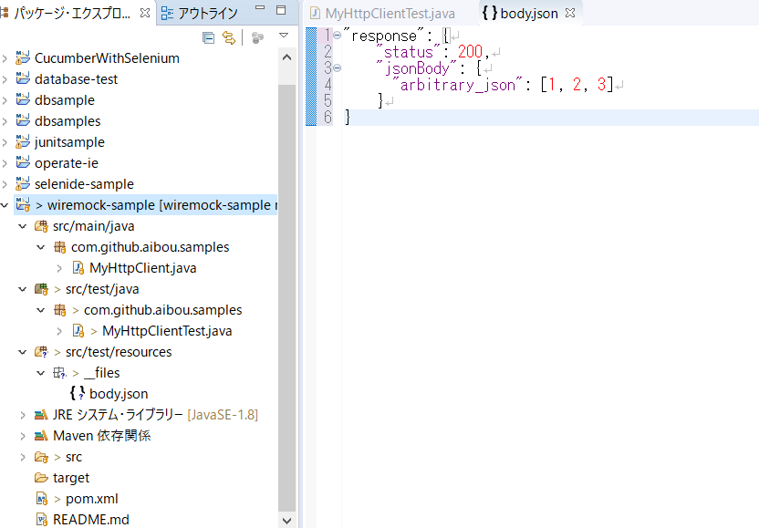

# テストダブル

- [JUnit実践入門]([https://www.amazon.co.jp/JUnit%E5%AE%9F%E8%B7%B5%E5%85%A5%E9%96%80-%E4%BD%93%E7%B3%BB%E7%9A%84%E3%81%AB%E5%AD%A6%E3%81%B6%E3%83%A6%E3%83%8B%E3%83%83%E3%83%88%E3%83%86%E3%82%B9%E3%83%88%E3%81%AE%E6%8A%80%E6%B3%95-WEB-PRESS-plus/dp/477415377X](https://www.amazon.co.jp/JUnit実践入門-体系的に学ぶユニットテストの技法-WEB-PRESS-plus/dp/477415377X))の内容をまとめ

- テスト時に依存するオブジェクトがある場合、そのオブジェクトを「代役」で置き換える方法が有効。この代役となるオブジェクトはスタブやモックとして知られ、総称してテストダブル(test double)と呼ばれる
  - double は演劇や映画の代役、影武者の意味


## スタブ

- 依存オブジェクトに予測可能な振る舞いをさせる。

おもに次のような場合に使用される。

- 依存オブジェクトが予測出来ない振る舞いをする
- 依存オブジェクトのクラスがまだ存在しない
- 依存オブジェクトの実行コストが高く、簡単に利用できない
- 依存オブジェクトが実行環境に強く依存している


## モック

- モックは依存クラスやモジュールが正しく利用されているかを検証する目的で使われる


## スタブとモックの違い

- **スタブ**は仮の実装で予測可能な値を返すことで、予測が難しいテストケースを検証可能なテストケースとする。一方**モック**は目的のメソッドがテストの実行中に呼び出されたかを検証することが主な目的


## スパイ

- 依存オブジェクトの呼び出しを監視するのにつかわれる
  - ログの検証等で使用


- [【Java】Mockitoの飲み方（入門）](https://orizuru.io/blog/java/mockito-primer/)に記載の図が分かりやすいので掲載しておきます。


## Mochitoのサンプル

- モックやスタブを簡単に実装できるMochitoのサンプルを上記書籍をベースに実装してみた

- まずはpomに記載

```xml
<!-- https://mvnrepository.com/artifact/org.mockito/mockito-all -->
<dependency>
    <groupId>org.mockito</groupId>
    <artifactId>mockito-all</artifactId>
    <version>1.10.19</version>
    <scope>test</scope>
</dependency>
```

- 以下がコード

```java
import static org.hamcrest.CoreMatchers.*;
import static org.junit.Assert.*;
import static org.mockito.Mockito.*;

import java.util.LinkedList;
import java.util.List;

import org.junit.Test;

public class MockTest {

	@Test
	public void mockTest() {
		//mockメソッドで生成されたオブジェクトはすべてのメソッドがnullを返す
		//スタブメソッドとして設定される
		List<String> mock = mock(List.class);
		assertThat(mock.get(0),is(nullValue()));
		assertThat(mock.contains("Hello"),is(false));
	}

	@Test
	public void stubTest() {
		List<String> stub = mock(List.class);
		when(stub.get(0)).thenReturn("Hello");
		assertThat(stub.get(0),is("Hello"));
	}

	@Test
	public void spyTest() {
		List<String> list = new LinkedList<String>();
		List<String> spy = spy(list);
		doReturn("Mochito").when(spy).get(1);
		spy.add("Hello");
		spy.add("World");
		verify(spy).add("Hello");
		verify(spy).add("World");
		assertThat(spy.get(0),is("Hello"));
		assertThat(spy.get(1),is("Mochito"));
		//こう書くと実際のメソッドが呼ばれる
		when(spy.get(1)).thenCallRealMethod();
		assertThat(spy.get(1),is("World"));
	}
}
```

## WireMockのサンプル

- Rest APIのテストをするときに実際にサーバをたてなくてもWireMockを使えばテスト出来てしまう
- WireMock自体は単体でも動作可能なので、まずは単体で動かしてみてイメージする
  - [WireMockをスタンドアローンで使うときの基本的なメモ](https://qiita.com/rubytomato@github/items/c0f4f8f882c2069d91f0)を参考に写経すれば何をするものかはイメージできるはず
- このWireMockをJUnitで使おうというのがこの項の趣旨

-  [aibou/wiremock-sample](https://github.com/aibou/wiremock-sample)のコードを実施に動かしてみるのが手っ取り早い
  - ここでは上のコードを転載しておく
  - registerStubsでスタブを登録しておくと、http://localhost:8089/200 に接続するとステータス 200を返し、http://localhost:8089/302 に接続するとステータス302を返してくれる。

```java
public class MyHttpClientTest {
    @ClassRule
    public static WireMockRule wireMockRule = new WireMockRule(8089);

    @BeforeClass
    public static void registerStubs() {
        stubFor(get(urlPathEqualTo("/200"))
                .willReturn(
                        aResponse().withStatus(200)
                ));

        stubFor(get(urlPathEqualTo("/302"))
                .willReturn(
                        aResponse().withStatus(302)
                ));

        stubFor(get(urlPathEqualTo("/401"))
                .willReturn(
                        aResponse().withStatus(401)
                ));

        stubFor(get(urlPathEqualTo("/500"))
                .willReturn(
                        aResponse().withStatus(500)
                ));

        stubFor(get(urlPathEqualTo("/timeout"))
                .willReturn(
                        aResponse().withStatus(200)
                                .withFixedDelay(2000)
                ));
    }

    @Test
    public void returns_1000_when_status_is_200() throws IOException {
        MyHttpClient client = new MyHttpClient();
        assertThat(client.fetchStatus("http://localhost:8089/200"), is(1000));
    }

    @Test
    public void returns_1510_when_status_is_302() throws IOException {
        MyHttpClient client = new MyHttpClient();
        assertThat(client.fetchStatus("http://localhost:8089/302"), is(1510));
    }

    @Test
    public void returns_2005_when_status_is_401() throws IOException {
        MyHttpClient client = new MyHttpClient();
        assertThat(client.fetchStatus("http://localhost:8089/401"), is(2005));
    }

    @Test
    public void returns_2500_when_status_is_500() throws IOException {
        MyHttpClient client = new MyHttpClient();
        assertThat(client.fetchStatus("http://localhost:8089/500"), is(2500));
    }

    @Test(expected = SocketTimeoutException.class)
    public void タイムアウト() throws IOException {
        new MyHttpClient().fetchStatus("http://localhost:8089/timeout");
    }
}
```

- その他、公式サイトの [Getting Started](http://wiremock.org/docs/getting-started/) の記事も参照
- 上のサンプルでは自作したHttpClient(MyHttpClient)ないでステータスコードを５倍している。RestAssuredを使った例も書き加えると以下のような感じ

```java
@Test
public void returns_1000_when_status_is_200() throws IOException {
    MyHttpClient client = new MyHttpClient();
    assertThat(client.fetchStatus("http://localhost:8089/200"), is(1000));
    //another example
    RestAssured.baseURI = "http://localhost:8089/200";
    given().get("").then().statusCode(200);
}

@Test
public void returns_1510_when_status_is_302() throws IOException {
    MyHttpClient client = new MyHttpClient();
    assertThat(client.fetchStatus("http://localhost:8089/302"), is(1510));
    //another example
    RestAssured.baseURI = "http://localhost:8089/302";
    given().get().then().statusCode(302);
}

@Test
public void returns_2005_when_status_is_401() throws IOException {
    MyHttpClient client = new MyHttpClient();
    assertThat(client.fetchStatus("http://localhost:8089/401"), is(2005));
    //another example
    RestAssured.baseURI = "http://localhost:8089/401";
    given().get().then().statusCode(401);
}

@Test
public void returns_2500_when_status_is_500() throws IOException {
    MyHttpClient client = new MyHttpClient();
    assertThat(client.fetchStatus("http://localhost:8089/500"), is(2500));
    //another example
    RestAssured.baseURI = "http://localhost:8089/500";
    given().get().then().statusCode(500);
}

@Test(expected = SocketTimeoutException.class)
public void タイムアウト() throws IOException {
    new MyHttpClient().fetchStatus("http://localhost:8089/timeout");
    //another example
    RestAssured.baseURI = "http://localhost:8089/timeout";
    given().get().then().statusCode(200);
}
```

- responseのbodyにファイルを含めるには、`src\test\resources` 以下に `__files` という名前のフォルダを作成して、その中に返却したいファイルを作成。今回はbody.jsonという名前のjson形式ファイルを作成。

```json
"response": {
    "status": 200,
    "jsonBody": {
      "arbitrary_json": [1, 2, 3]
    }
}
```

- その上でコードを以下のように修正する（追記箇所のみ抜粋）

```java
public class MyHttpClientTest {
    @ClassRule
    public static WireMockRule wireMockRule = new WireMockRule(8089);

    @BeforeClass
    public static void registerStubs() {
        //省略
        
        stubFor(get(urlEqualTo("/body-file"))
                .willReturn(aResponse()
                        .withBodyFile("body.json")));
    }

    //省略

    @Test
    public void returns_json() {
        RestAssured.baseURI = "http://localhost:8089/body-file";
        given().get().then().statusCode(200);
        String response = given().get().asString();
        System.out.println(response);
    }
}
```




- ソースコードはGitHubにあげています。