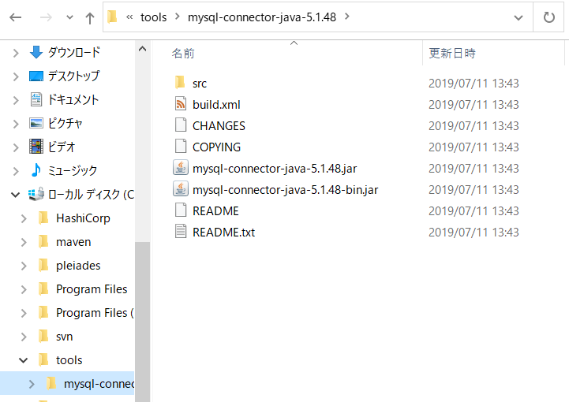
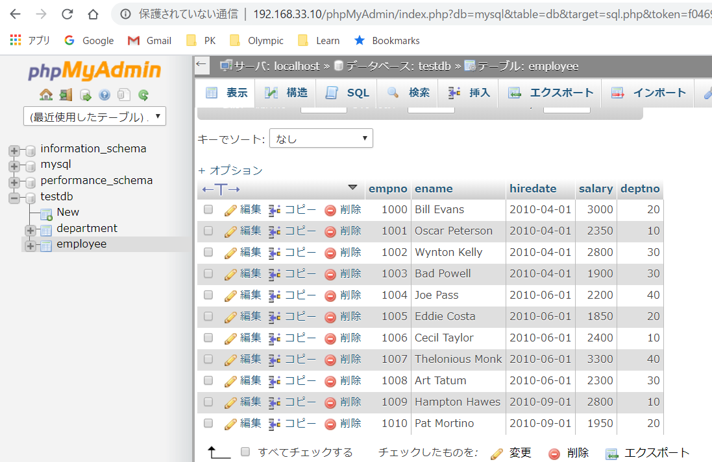
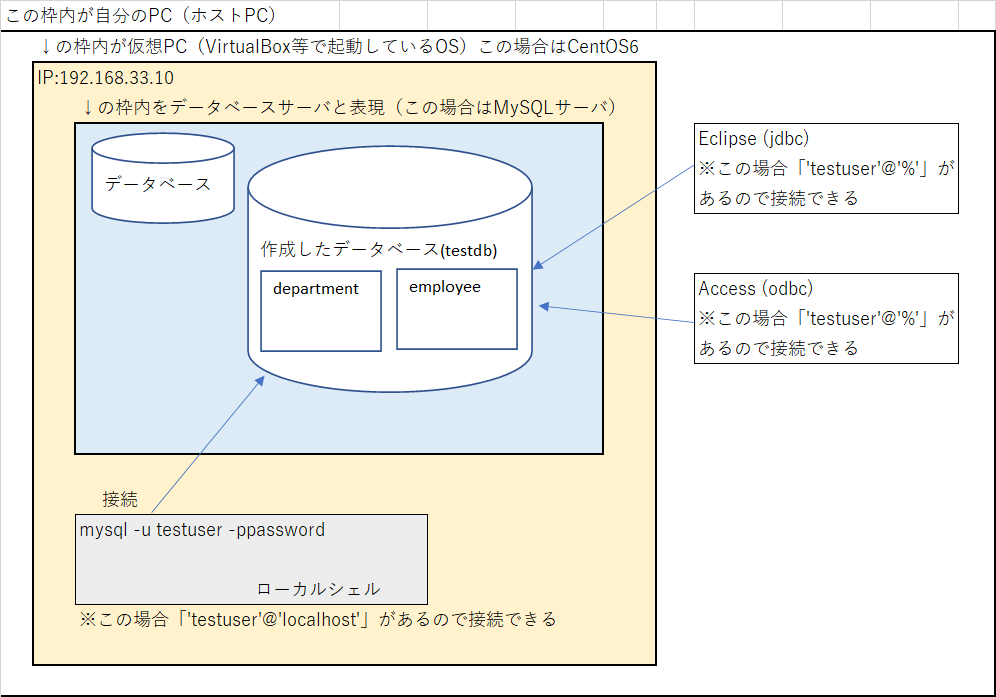
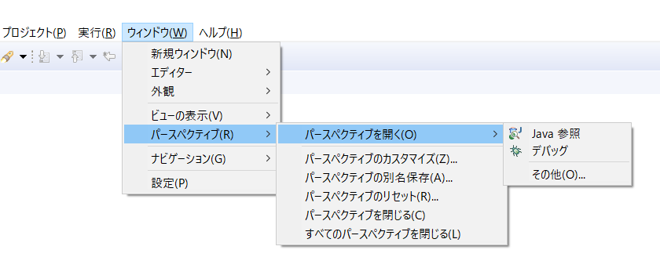
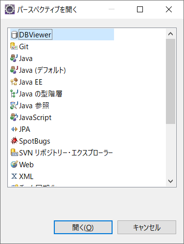
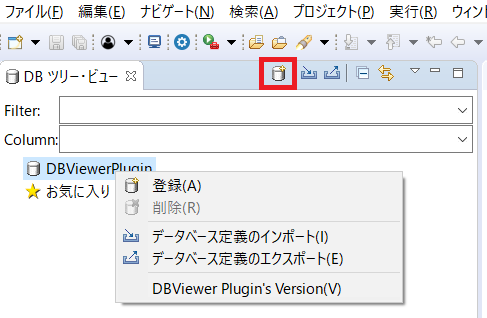
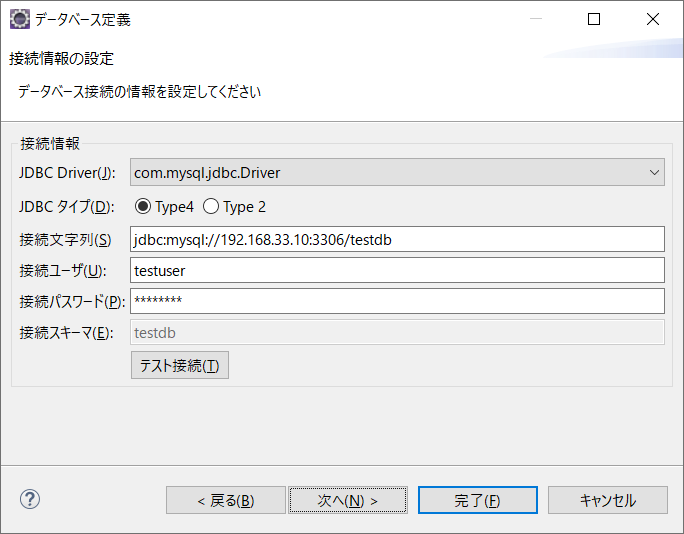

# データベース操作

- ここではJavaからデータベース操作する方法を説明する
- 使用する予定の環境やソフトは以下
  - ローカルサーバ環境
  - DBCP（データベース接続用）
  - DBUtil（データベース操作用）


## 事前準備

- ローカルサーバ環境は Dotinstall の講座「[ローカル開発環境の構築 [Windows編]](https://dotinstall.com/lessons/basic_localdev_win_v2)」で構築

- phpMyAdminインストール
- EclipseにDBViewerプラグインをインストール
  - Windows用のMySQL-JDBCドライバを[公式サイト](https://www.mysql.com/jp/products/connector/)からダウンロードし、適当な場所に保存しておく
  - ここでは「C:\tools\mysql-connector-java-5.1.48」に保存した




## 概略

1. 事前準備
2. ローカルサーバにデータベースとテーブルを作成
3. 作成したデータベースを操作するためのユーザを作成
4. ローカルから（ローカルサーバにある）データベースにアクセス
5. JDBCでデータベースに接続し操作
6. DBCPを用いてデータベース接続
7. DBUtilを用いてデータベース操作


## 1. 事前準備

1. ローカルサーバ環境は上記した通りなので省略
2. phpMyAdminインストール

```bash
$ yum update
$ yum list installed | grep php #すでにインストール済のソフトを確認
$ sudo yum install -y  phpMyAdmin
(中略)
--> 依存性解決を終了しました。
エラー: パッケージ: php-bcmath-5.3.3-50.el6_10.x86_64 (updates)
             要求: php-common(x86-64) = 5.3.3-50.el6_10
            インストール: php-common-5.6.40-19.el6.remi.x86_64 (@remi-php56)
                php-common(x86-64) = 5.6.40-19.el6.remi
            利用可能: php-common-5.3.3-49.el6.x86_64 (base)
                php-common(x86-64) = 5.3.3-49.el6
            利用可能: php-common-5.3.3-50.el6_10.x86_64 (updates)
                php-common(x86-64) = 5.3.3-50.el6_10
エラー: パッケージ: php-mcrypt-5.3.3-5.el6.x86_64 (epel)
             要求: php(zend-abi) = 20090626
            インストール: php-common-5.6.40-19.el6.remi.x86_64 (@remi-php56)
                php(zend-abi) = 20131226-64
            利用可能: php-common-5.3.3-49.el6.x86_64 (base)
                php(zend-abi) = 20090626
            利用可能: php-common-5.3.3-50.el6_10.x86_64 (updates)
                php(zend-abi) = 20090626
エラー: パッケージ: php-mcrypt-5.3.3-5.el6.x86_64 (epel)
             要求: php(api) = 20090626
            インストール: php-common-5.6.40-19.el6.remi.x86_64 (@remi-php56)
                php(api) = 20131106-64
            利用可能: php-common-5.3.3-49.el6.x86_64 (base)
                php(api) = 20090626
            利用可能: php-common-5.3.3-50.el6_10.x86_64 (updates)
                php(api) = 20090626
エラー: パッケージ: php-tidy-5.3.3-50.el6_10.x86_64 (updates)
             要求: php-common(x86-64) = 5.3.3-50.el6_10
            インストール: php-common-5.6.40-19.el6.remi.x86_64 (@remi-php56)
                php-common(x86-64) = 5.6.40-19.el6.remi
            利用可能: php-common-5.3.3-49.el6.x86_64 (base)
                php-common(x86-64) = 5.3.3-49.el6
            利用可能: php-common-5.3.3-50.el6_10.x86_64 (updates)
                php-common(x86-64) = 5.3.3-50.el6_10
エラー: パッケージ: php-process-5.3.3-50.el6_10.x86_64 (updates)
             要求: php-common(x86-64) = 5.3.3-50.el6_10
            インストール: php-common-5.6.40-19.el6.remi.x86_64 (@remi-php56)
                php-common(x86-64) = 5.6.40-19.el6.remi
            利用可能: php-common-5.3.3-49.el6.x86_64 (base)
                php-common(x86-64) = 5.3.3-49.el6
            利用可能: php-common-5.3.3-50.el6_10.x86_64 (updates)
                php-common(x86-64) = 5.3.3-50.el6_10
#山のようにエラーが..　バージョンに問題があるらしいので以下のようにする
#参考：https://qiita.com/u-dai/items/4a88e2f9a188e41ead70
$ sudo yum --enablerepo=remi-php56 install -y  phpMyAdmin

#接続設定が必要らしい
#参考：https://qiita.com/mtb84459/items/1f3491c6eafdcd55ae04
$  sudo vim /etc/httpd/conf.d/phpMyAdmin.conf

Alias /phpMyAdmin /usr/share/phpMyAdmin
Alias /phpmyadmin /usr/share/phpMyAdmin

<Directory /usr/share/phpMyAdmin/>
   AddDefaultCharset UTF-8

   <IfModule mod_authz_core.c>
     # Apache 2.4
     <RequireAny>
       Require ip 127.0.0.1
       Require ip ::1
     </RequireAny>
   </IfModule>
   <IfModule !mod_authz_core.c>
     # Apache 2.2
     Order Deny,Allow
     #Deny from All               #<----------ここをコメントアウト
     Allow from 127.0.0.1
     Allow from ::1
   </IfModule>
</Directory>

$ sudo service httpd restart

# この状態で接続可能となる
# ログインしようとするとパスワードなしはダメだといわれるのでパスワードを設定

$ mysql -u root
mysql> set password for root@localhost = password('root');

# これで無事に接続できるようになる。dotinstallの講座の通りに進めていれば以下で接続可
# http://192.168.33.10/phpMyAdmin
```

3. EclipseにDBViewerプラグインを追加

   ヘルプ＞マーケットプレイスから検索してインストールするだけなので詳細は省略


## 2. ローカルサーバにデータベースとテーブルを作成

- ローカルサーバにテスト用のデータベースとテーブルを作成
- ついでにいくつかのデータも挿入しておく
  - なお以下のテーブル構造については「基礎JSP&サーブレット」に掲載のものをそのまま使っている

```bash
> mysql - u root -proot
#DB作成
mysql> create database testdb;
#確認
msyql> show databases;
#作成したDBを使用
mysql> use testdb;

#テーブル作成
mysql> create table employee (
    empno int primary key,
    ename char(15) not null,
    hiredate date,
    salary int,
    deptno int
);
mysql> create table department (
    deptno int primary key,
    dname char(10) not null,
    location char(12)
);
#テーブル確認
mysql> show tables;
#データ挿入
mysql> insert into department values(10,'General','NY');
mysql> insert into department values(20,'Accounting','Pennsylvania');
mysql> insert into department values(30,'Sales','Connecticut');
mysql> insert into department values(40,'R&D','Georgia');

mysql> insert into employee values(1000,'Bill Evans','2010-04-01',3000,20);
mysql> insert into employee values(1001,'Oscar Peterson','2010-04-01',2350,10);
mysql> insert into employee values(1002,'Wynton Kelly','2010-04-01',2800,30);
mysql> insert into employee values(1003,'Bad Powell','2010-04-01',1900,30);
mysql> insert into employee values(1004,'Joe Pass','2010-06-01',2200,40);
mysql> insert into employee values(1005,'Eddie Costa','2010-06-01',1850,20);
mysql> insert into employee values(1006,'Cecil Taylor','2010-06-01',2400,10);
mysql> insert into employee values(1007,'Thelonious Monk','2010-06-01',3300,40);
mysql> insert into employee values(1008,'Art Tatum','2010-06-01',2300,30);
mysql> insert into employee values(1009,'Hampton Hawes','2010-09-01',2800,10);
mysql> insert into employee values(1010,'Pat Mortino','2010-09-01',1950,20);
```

- コピペしやすいようにSQLコマンドだけ抜き出し

```
create table employee (
    empno int primary key,
    ename char(15) not null,
    hiredate date,
    salary int,
    deptno int
);
create table department (
    deptno int primary key,
    dname char(10) not null,
    location char(12)
);
insert into department values(10,'General','NY');
insert into department values(20,'Accounting','Pennsylvania');
insert into department values(30,'Sales','Connecticut');
insert into department values(40,'R&D','Georgia');
insert into employee values(1000,'Bill Evans','2010-04-01',3000,20);
insert into employee values(1001,'Oscar Peterson','2010-04-01',2350,10);
insert into employee values(1002,'Wynton Kelly','2010-04-01',2800,30);
insert into employee values(1003,'Bad Powell','2010-04-01',1900,30);
insert into employee values(1004,'Joe Pass','2010-06-01',2200,40);
insert into employee values(1005,'Eddie Costa','2010-06-01',1850,20);
insert into employee values(1006,'Cecil Taylor','2010-06-01',2400,10);
insert into employee values(1007,'Thelonious Monk','2010-06-01',3300,40);
insert into employee values(1008,'Art Tatum','2010-06-01',2300,30);
insert into employee values(1009,'Hampton Hawes','2010-09-01',2800,10);
insert into employee values(1010,'Pat Mortino','2010-09-01',1950,20);
```


- phpMyAdminからも作成したデータベースやテーブルのデータを確認できる




## 3. 作成したデータベースを操作するためのユーザを作成

- 現状ではローカルサーバ内からの接続しかできない。
- さらに root ユーザでの操作は危険も伴うため、外部から接続可能なテストユーザを作成する

```bash
> mysql -u root -proot
#現状の確認
mysql> SELECT user, host FROM mysql.user;
+------+-----------------------+
| user | host                  |
+------+-----------------------+
| root | 127.0.0.1             |
| root | ::1                   |
|      | localhost             |
| root | localhost             |
|      | localhost.localdomain |
| root | localhost.localdomain |
+------+-----------------------+
6 rows in set (0.00 sec)
#ユーザ作成（補足参照）
mysql> grant all on testdb.* to 'testuser'@'%' identified by 'password';
mysql> grant all on testdb.* to 'testuser'@'localhost' identified by 'password';
#確認
mysql> exit
#作成したユーザでログインできるか？
> mysql -u testuser -ppassword
mysql> show databases;
+--------------------+
| Database           |
+--------------------+
| information_schema |
| testdb             |
+--------------------+
2 rows in set (0.00 sec)
#うまくいった！
```

- ユーザ作成の補足
  - ここ大分はまりました。本来なら１つ目の％指定しているコマンドだけでローカルと外部も対応できると思ったけど、そうではないらしい。％にローカルは含まれないので２つ目のコマンドが必要となる
  - 参照：https://b.l0g.jp/mysql/user-at-localhost/


## 4. ローカルから（サーバにある）データベースにアクセス

- 日本語分かりにくいですが、図にすると以下のような感じ
  - 灰色の箇所は３．で説明した接続
  - これから説明するのは、Eclipseから接続する方法。つまりローカル側（ホストPC）からローカルサーバのDBにアクセスする方法



- EclipseにインストールしたDBViewerからデータベースに接続する

1. Eclipseのメニュで、ウィンドウ＞パースペクティブ＞パースペクティブを開く＞その他　を選択



２．DBViewerを選択


3. DBViewerPlugin を右クリックして登録を選択、または赤枠のアイコンをクリック



4. データベース定義名に適当な名称を入れてファイルの追加をクリックし先ほど保存したMySQLのJDBCドライバーを選択し、開いた後に次へ


5. 以下の画像のように入力した後、テスト接続で成功することを確認し完了

   パスワードは設定したものを指定



6. 左側のツリーに表示される接続情報をダブルクリック

   さらに testdb以下のtable以下にある department や employeeをダブルクリックすると挿入した情報の一覧が確認できる


7. 切断する場合には、centos-mysql を右クリック＞切断


**※少し長めの記事になったのでこれ以降の内容は別の資料でまとめていきます**