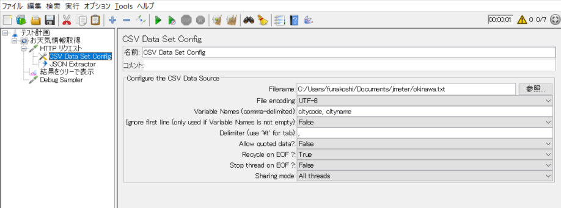

# JMeterでパラメータ化テストを実施

[JMeterを使用してWebAPIテストを実施する](https://github.com/funakosi/programming/tree/master/jmeter)サンプルを以前作成した。

ここでは別のWebAPIテストを実施する方法を説明し、さらにCSVで指定されたパラメータ一覧を順次読み取ってテストしていく手法（JUnitで言うところのパラメータ化テスト）を説明する。


## 前提条件

- JMeterのインストールや使い方については上でも紹介したリンク（[JMeterを使用してWebAPIテストを実施する](https://github.com/funakosi/programming/tree/master/jmeter)）を参照
- WebAPIはライブドアが提供する[お天気Webサービス](http://weather.livedoor.com/weather_hacks/webservice)を使用する
  - APIの仕様については上のリンクを参照
  - パラメータとして使用するコードは[全国の地点定義表](http://weather.livedoor.com/forecast/rss/primary_area.xml)を参照（上のリンク内でも記載されている）


## 基本的な手順

- まずは１つの地点の天気情報を取得するための手順を記載

1. JMeterを起動

2. テスト計画を右クリック > 追加 > Threads(User) > スレッドグループ
   名前を適当に入力。ここでは「お天気情報取得」とし保存

3. お天気情報取得を右クリック > 追加 > サンプラー > HTTPリクエスト

4. 以下のように情報を入力していく

   1. プロトコル：http
   2. サーバ名またはIP：weather.livedoor.com/forecast/webservice/json
   3. ポート番号：80
   4. メソッド：GET
   5. パス：/v1
   6. Parameters：追加でパラメータを追加し名前と値は以下を指定
      1. 名前：city
      2. 値：471010

5. お天気情報取得を右クリック > 追加 > リスナー > 結果をツリーで表示

最終的に以下のような設定になる。

- Thread Group

  

- Http Request

  

- View Result Tree

  

最後に緑の▶ボタンで実行してみると、正常にレスポンスが返ってくることが分かる。


## パラメータ化テストの実施手順

1. CSVデータの準備
   以下のような内容のCSVデータを用意する。ここではエンコード：UTF-8を指定している
   1列目がパラメータとして使う地点コードでカンマ区切りで2列目が地点名となる

   ```bash
   $ cat okinawa.txt
   471010,那覇
   471020,名護
   471030,久米島
   472000,南大東
   473000,宮古
   474010,石垣
   474020,与那国
   ```

2. JMeterで先ほどの Thread Groupに設定を追加していく

   1. HTTP リクエスト右クリック > 追加 > 設定エレメント > CSV Data Set COnfig
   2. FileName: 上で準備した okinawa.txt を指定する
   3. File Encoding: UTF-8を指定
   4. Variable name: citycode, cityname     と指定する
   5. 他は必要に応じて変更するが、ここではそのままの状態とする

   

3. Httpリクエストのパラメータを、上で指定した変数名で指定する。

   値の欄：471010 -> ${citycode}

   

4. この状態で実行してみる
   1件だけデータが取得されているのが分かる


4. 上のCSVで指定されている7地点の天気を取得するには、スレッドグループのプロパティを変更する

   - スレッド数：7
   - Ramp-Up 期間(秒)：1
   - ループ回数：1

   

   これで実行すると7件実行されているのが分かる。

   

上の設定項目の内容は以下の通り。この内容は[ここのサイト](https://christina04.hatenablog.com/entry/2017/10/03/190000)をベースに記載している。

- スレッド数
  JMeterが生成するクライアント数。スレッド数＝アクセスするユーザ数と考えてOK

- Ramp-Up期間
  設定したスレッド数を何秒以内に起動・実行するかを指定する
  上の設定でいえば、７つのスレッド（クライアント数又はアクセスユーザ数）を１秒以内に実行する
  各スレッドは前のスレッドが開始されてから1/7秒毎に開始

  （参考）ramp up : （生産などが）増える

- ループ回数
  1スレッドが１つのテストケースを何回繰り返すかを指定する

5. 最後に応答データの一部を取り出し、それを表示させてみる

   1. HTTPリクエストを右クリック > 追加 > 後処理 > JSON Extractor

      - Names of created variables: title

      - JSON Path expressions: $.title

   2. お天気情報を右クリック > 追加 > サンプラー > Debug Sampler

   

6. この状態で実行すると取得したCSVの情報や先ほど設定したJSONのtitle情報が表示される
   


### 最終的な設定内容は以下の通り

- HTTPリクエスト
  

- CSV Data Set Config
  

- JSON Extractor
  

- 結果をツリーで表示
  

- Debug Sampler
  