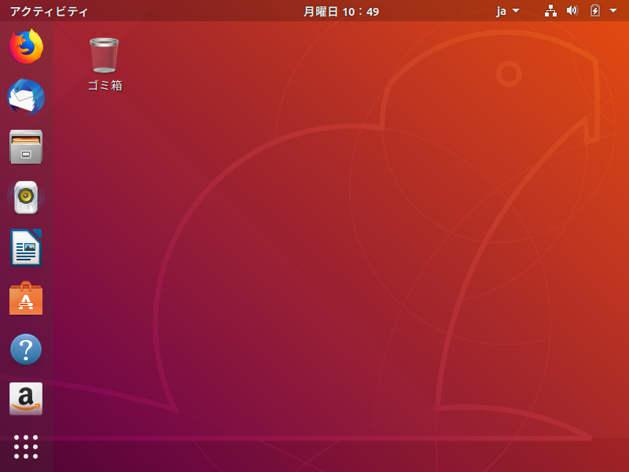

# LAMP環境でWordPress


この資料はローカル環境にLAMP環境を構築し、そこにブログシステムであるWordPressをインストールすることを通してLinux環境に慣れることを目的としている。

- LAMP環境とは、Linux + Apache + MySQL + PHP の略でありWeb開発でよく使われる組み合わせ
  - Linux: OS
  - Apache: Webサーバ
  - MySQL: データベースサーバ -> ここではMariaDBを使用する
  - PHP: 開発言語
  
- 構築手順の概要
  
  - 参考：[Ubuntu18.04にWordPress5.1をインストール](https://qiita.com/cherubim1111/items/265cfbbe91adb44562d5)
  
  1. VirtualBoxにUbuntuをインストール
     - [VirtualBoxとは](https://www.sejuku.net/blog/72833)
  2. UbuntuにApacheをインストール
     - [ApacheはWebサーバの1つ](https://www.kagoya.jp/howto/rentalserver/apache/)
  3. UbuntuにMariaDBをインストール
     - [MariaDBとは](https://ja.wikipedia.org/wiki/MariaDB)
  4. UbuntuにWordPressをインストール
     - WordPressはブログシステムでよく使われているオープンソースソフト（[公式サイト](https://ja.wordpress.org/))


## 1. Virtual Boxのインストールと設定

1. Virtual Boxのインストール
   [ダウンロードサイト](https://www.oracle.com/technetwork/server-storage/virtualbox/downloads/index.html?ssSourceSiteId=otnjp)から自分の環境にあうインストーラをダウンロードし、インストールを行う
   `注意` : CPUの仮想化技術(Virtualization Technology)が有効になっていないと以降の作業はできない可能性が高いので、必要に応じてBIOSの設定等を変更すること

2. Ubuntuのイメージをダウンロード
   [Ubuntuの配布サイト](https://jp.ubuntu.com/download)からインストールするUbuntuのイメージをダウンロードする。
   ここでは、Ubuntu Desktop 18.04.XX LTS 1を選択

3. Virtual Boxを起動し仮想マシンを追加

   1. 名前: Ubuntu18.04, タイプ: Linux, バージョン: Ubuntu(64-bit)

   2. メモリーサイズ: 2.0GB (2,048MB)

   3. 仮想的なハードディスクを追加する (VDI,可変サイズ,25GB)

      

4. Ubuntuをインストール

   1. 設定 > ストレージ > 右側パネルでCDアイコンを選択し、先ほどダウンロードしたUbuntuのインストーラを選択しOKで閉じる
      
   2. 起動するとUbuntuのインストーラが起動するので支持に従ってインストール
   3. 日本語を選択し、Ubuntuをインストールをクリック
   4. キーボードレイアウトを適宜変更し次へ（続けるをクリック）（よく若ならければ特に変更する必要はない）
   5. アップデートと他のソフトウェア画面は特に変更せず、そのまま次へ
   6. インストールの種類画面も特に変更なし、そのままインストール
      警告ダイアログが表示される可能性があるが、そのまま続ける
   7. 住まい: Tokyo
   8. ユーザ名やパスワードは適当に入力し次へ
      ローカルで使うものなので test 等の短い名前でも可
   9. インストールが開始されるのでしばらく待つ
   10. インストール終了後に再起動
       - そのままの状態だとインストールディスクがセットされた状態のため、うまく再起動されない
       - ファイル > 閉じる > 仮想マシンの電源オフで一度閉じる
       - １．の手順でCDにセットされているUbuntuのインストールディスクを選択解除にする
       - 起動
   11. 先ほど作成したユーザ名とパスワードでログインする

   

5. 使い易いように設定する（スクリーンサイズ）

   1. gcc, make, perlをインストール
      アプリケーションの表示からTerminalを検索して実行後に以下のコマンド実行しインストール

      ```bash
      $ sudo apt install gcc
      [sudo] user のパスワード:      #<---ログイン時に使用するパスワードを入力
      ...(省略)...
      続行しますか？[Y/n]            #<---そのままEnter
      $ sudo apt install make
      $ sudo apt install perl
      ```

   2. メニューのデバイス > Guest Addictions CD イメージの挿入

   3. ソフトウェアの実行確認画面が表示されるので、そのまま実行する

   4. 必要に応じてパスワードを入力するとインストールが実行される
      実行中にパッケージ不足でエラーが表示される場合は、1. の手順を参考に必要なパッケージをインストールする

   5. `Press Return to close this window..` が表示されたらEnterキーをクリックし画面を閉じる

   6. デバイス > 光学ドライブ > 仮想ドライブからディスクを除去、その後再起動する
      ファイル > 閉じる > 仮想マシンの電源オフで閉じた後に再度起動

   7. 再起動以降は、画面の大きさに追随してUbuntuのスクリーンサイズも変更される

6. 使いやすいように設定する（その他）

   1. メニュー デバイス > クリップボード > 双方向
   2. メニュー デバイス > ドラッグ＆ドロップ > 双方向
   3. 設定後、クリップボードの内容が共有できるようになる。また、ファイルをドラッグ＆ドロップで双方向で共有できるようになる。

7. Terminalをメニューに追加

   1. Ubuntuメニューの左側はお気に入りメニューで登録や削除が可能
   2. 不要なメニューはアイコンを右クリック > お気に入りから削除、で削除可能
   3. 画面左下をクリックまたはUbuntuにフォーカスがある状態でWindowsキーをクリックし、検索ボックスにTerminalと入力
   4. Terminalが起動したら、お気に入りにアイコンが表示されるので右クリック > お気に入りに追加

8. Ubuntu上でのコマンド操作に慣れる

   - [こちら](https://www.sejuku.net/blog/84286)のサイトを参考にコマンド入力に慣れておく
   - vi の基本的な使い方をマスターしておく
     vi (又は vim )はlinux操作では避けては通れないものと思っておく
     英語表記だが、[こちら](https://www.openvim.com/tutorial.html)ではWebサイト上でvi を学習することができる
     vi は理屈よりも実際に手を動かして実行していくほうが覚えは早いので、[ここ](https://www.server-memo.net/tips/command/vi/start_vi.html)やその他入門向けサイトを参考にして viを使用してみる

9. Ubuntuの最新化

   - Terminalで以下を実行しUbuntuの更新を行う (Windows Updateのようなもの)

   ```bash
   $ sudo apt update   #インストール可能パッケージの一覧を更新する
   $ sudo apt upgrade  #パッケージの更新を行う
   ```

10. スナップショットで保存
    - ここまでの作業内容を保存するためにスナップショットを作成する
    - メニュー 仮想マシン > 名前：初期設定完了 > OK
    - これで今後処理を失敗したとしても、いつでもこの状態まで戻ることが可能
    - スナップショットについては[ここ](https://pc-karuma.net/virtualbox-snapshot/)を参照。スナップショットの一覧は、VirtualBoxマネージャで対象の仮想マシンを選択後、メニュー 仮想マシン > ツール > スナップショットで確認できる

## 2. Apache をインストール

Webサーバを導入してPHPを使用できるように設定を行う。

1. Apache のインストール

```bash
# 毎回sudo付けて実行するのも面倒なので、スーパーユーザに切り替えて作業を行う。
# その際、プロンプトは $ではなく#と表示し区別
$ sudo su -
# apt update
# apt install apache2       #apache2をインストール
# systemctl enable apache2  #apache2サービス自動起動有効
# systemctl start apache2   #apache2サービス起動
```

2. Ubuntu上でFireFoxを起動し、URL入力欄（もしくは検索欄）に `localhost`と入力しEnter
3. UbuntuのDefaultページが表示される

4. php のインストール

```bash
$ sudo apt install php php-mysql php-mbstring
```

5. スナップショットの作成
   - Apacheインストール完了

## 3. MariaDBをインストール

1. MariaDBをインストール

```bash
$ sudo su -
# apt install mariadb-server mariadb-client
# systemctl enable mariadb  #サービスの自動起動有効
# systemctl start mariadb   #サービス起動
```

2. WordPress用のデータベースを作成

```bash
#rootユーザでmysqlに接続
$ sudo mysql
Welcome to the MySQL monitor.  Commands end with ; or \g.
Your MySQL connection id is 15
Server version: 5.7.27-0ubuntu0.18.04.1 (Ubuntu)

Copyright (c) 2000, 2019, Oracle and/or its affiliates. All rights reserved.

Oracle is a registered trademark of Oracle Corporation and/or its
affiliates. Other names may be trademarks of their respective
owners.

Type 'help;' or '\h' for help. Type '\c' to clear the current input statement.

mysql>   #<--ここにコマンドを入力していく
mysql> create database wordpress default character set utf8; #データベース作成
mysql> show databases; #データベース一覧を表示し確認
```

3. WrodPress用データベースユーザの作成
   上に引き続き `mysql> ` コマンドプロンプトで実行していく

```bash
# 下のコマンドは日本語で表現すると以下のようになる
# 上で作成したwordpressデータベースに対して、全てのアクセス権限を有するwordpressという名前のユーザを作成する。その際パスワードは、passwordとする。
mysql> grant all on wordpress.* to wordpress@localhost identified by 'password';
mysql> flush privileges; #設定を反映
mysql> exit
```

4. 設定が反映されているか確認

```bash
$ mysql -u wordpress -p
Enter password:   #パスワードを入力
..(省略)..
MariaDB [(none)]> 
MariaDB [(none)]> show databases;
+--------------------+
| Database           |
+--------------------+
| information_schema |
| wordpress          | #wordpressが表示される
+--------------------+
2 rows in set (0.00 sec)

MariaDB [(none)]> exit
```

5. スナップショットを作成

- 名前：DBインストール完了

## 4. WordPressをインストール

1. WordPressをダウンロードと展開

```bash
$ sudo su -
# cd /var/www/html #DocumentRootに移動
# wget https://ja.wordpress.org/latest-ja.tar.gz #最新のWordPressをダウンロード
# tar xvf latest-ja.tar.gz #解凍
# chown -R www-data:www-data /var/www/html
```

2. WordPress初期設定
   - Ubuntuでブラウザを表示し `localhost/wordpress`と入力し移動
   - さあ、始めましょう！をクリック
   - データベースのユーザ名 (wordpress)とパスワード (password)を入力し送信
   - インストール実行
   - サイトのタイトル：LAMP環境でブログ構築、ユーザー名：admin、メールアドレス：適当なアドレスを入力して WordPressをインストールをクリック
   - ログイン情報は保存しておく（ローカル環境なので）
   - ログインボタンをクリック
   - ログイン情報を保存していれば、ユーザ名やパスワードは自動で入力されるのでそのままログイン
   - ダッシュボードが表示される
   - 画面上部のタイトル（LAMP環境でブログ構築）をクリックすると、ブログのトップに遷移する
3. スナップショットを作成
   - 名前：ブログ完成

## 5. 今後

- ブログシステムに興味がある場合は、構築したWordPressのデザイン変更等を試してみる

- いろいろな組み合わせを試してみる
  - Ubuntu以外のOSを使用して同様のことを試してみる
  - Apache以外のWebサーバを使用してWordPress環境を構築してみる
  - 使用するDBを変更してみる（MySQL, PostgreSQL等々）
  - WordPress以外のシステムをインストールしてみる