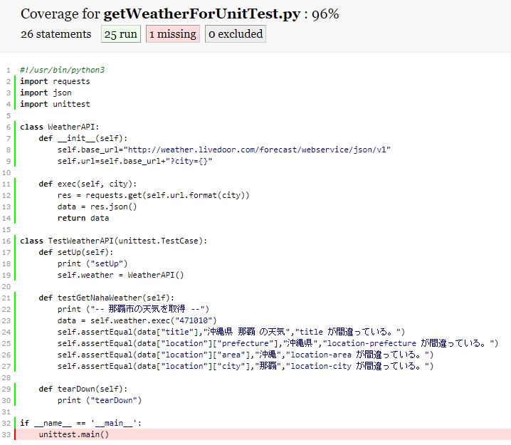

# Pythonでユニットテスト

Pythonでユニットテストを書く方法を２つ紹介

1. doctest
2. unittest

ついでにカバレッジを取得する方法についても言及していく。


## 前提条件

- WSL(Ubuntu)環境を使用して実装と確認を行う（WSLについては[こちら](https://github.com/funakosi/programming/tree/master/linux)を参照）

- 使用する Python のバージョンは、3.6.8


## 参考にしたサイト等

- [Pythonドキュメント](https://docs.python.org/ja/3/library/doctest.html)
- [15時間でわかるPython集中講義]([https://www.amazon.co.jp/15%E6%99%82%E9%96%93%E3%81%A7%E3%82%8F%E3%81%8B%E3%82%8B-Python%E9%9B%86%E4%B8%AD%E8%AC%9B%E5%BA%A7-%E5%B0%8F%E7%94%B0%E5%88%87-%E7%AF%A4/dp/4774178926](https://www.amazon.co.jp/15時間でわかる-Python集中講座-小田切-篤/dp/4774178926))


## 1. doctest

- モジュールやクラスなどドキュメント対象の使い方・振る舞いをテスト
- パターン網羅を目的としたテストには不向き


### 以下サンプルソース

```python
#!/usr/bin/python3
import requests
import json

class WeatherAPI:
    def __init__(self):
        self.base_url="http://weather.livedoor.com/forecast/webservice/json/v1"
        self.url=self.base_url+"?city={}"

    def exec(self, city):
        res = requests.get(self.url.format(city))
        data = res.json()
        return data

def getOkinawaWeather(city):
    """沖縄の天気を取得する。

    >>> getOkinawaWeather("471010")
    沖縄県 那覇 の天気
    >>> getOkinawaWeather("471020")
    沖縄県 名護 の天気
    >>> getOkinawaWeather("474010")
    沖縄県 石垣島 の天気
    """
    weather = WeatherAPI()
    data = weather.exec(city) 
    print(data["title"])

if __name__ == '__main__':
    import doctest
    doctest.testmod()

```

- 実行は以下のように普通にスクリプトを実行するだけ

  `$ ./getWeatherForDocTest.py`

- 結果は、正常終了であれば何も表示されない

## 2.unittest

- Python自動テストの主力
- doctestに比べより細かいチェック機能や各種仕組みが準備されている


### 以下サンプルソース

```python
#!/usr/bin/python3
import requests
import json
import unittest

class WeatherAPI:
    def __init__(self):
        self.base_url="http://weather.livedoor.com/forecast/webservice/json/v1"
        self.url=self.base_url+"?city={}"

    def exec(self, city):
        res = requests.get(self.url.format(city))
        data = res.json()
        return data

class TestWeatherAPI(unittest.TestCase):
    def setUp(self):
        print ("setUp")
        self.weather = WeatherAPI()
    
    def testGetNahaWeather(self):
        print ("-- 那覇市の天気を取得 --")
        data = self.weather.exec("471010")
        self.assertEqual(data["title"],"沖縄県 那覇 の天気","title が間違っている。")
        self.assertEqual(data["location"]["prefecture"],"沖縄県","location-prefecture が間違っている。")
        self.assertEqual(data["location"]["area"],"沖縄","location-area が間違っている。")
        self.assertEqual(data["location"]["city"],"那覇","location-city が間違っている。")
        
    def tearDown(self):
        print ("tearDown")

if __name__ == '__main__':
    unittest.main()

```

- 実行は以下のように普通にスクリプトを実行するだけ

  ```bash
  $ ./getWeatherForUnitTest.py
  setUp                                                                 
  -- 那覇市の天気を取得 --                                                       
  tearDown                                                              
  .                                                                     
  ----------------------------------------------------------------------
  Ran 1 test in 0.340s                                                  
                                                                        
  OK                                                                    
  ```


## 3.カバレッジ取得

- coverageコマンドを使用してテストのカバレッジ（網羅率）を取得する

- coverageのインストール

  ```bash
  # python3系なのでpip3を使用
  $ pip3 install coverage
  ```

- これで `coverage`コマンドが使用できるはずなのだが、現時点(19年08月時点)のWSL-Ubuntu環境でなぜかコマンドエラーとなる。仕方がないのでモジュールとして呼び出す

  ```bash
  # 以下はエラー
  $ coverage --version
  # 以下で対応していく
  $ python3 -m coverage --version
  Coverage.py, version 4.5.4 with C extension
  Documentation at https://coverage.readthedocs.io
  ```

- coverageコマンドを試す

  ```bash
  # eraseで初期化
  $ python3 -m coverage erase
  # カバレッジ取得
  $ python3 -m coverage run -m unittest getWeatherForUnitTest.py
  setUp
  -- 那覇市の天気を取得 --
  tearDown
  .
  ----------------------------------------------------------------------
  Ran 1 test in 0.325s
  
  OK
  # レポートを表示する
  $ python3 -m coverage report -m getWeatherForUnitTest.py
  Name                       Stmts   Miss  Cover   Missing
  --------------------------------------------------------
  getWeatherForUnitTest.py      26      1    96%   33
  # HTML形式でレポート表示
  $ python3 -m coverage html
  # htmlcov/index.html をブラウザで表示して結果を確認する
  ```

- HTML形式のレポートで視覚的に結果を確認することができる。

  