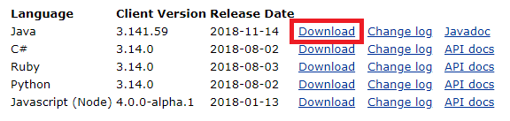
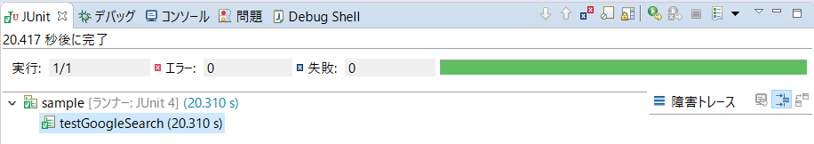

# EclipseでSelenium (初歩の初歩)

- EclipseでSeleniumを使用可能にするまでの最低限の手順を記載


## 前提条件

- JDKとEclipseのインストールと設定までは終わっていること（[Selenium入門ドリル用環境構築]([https://github.com/funakosi/programming/blob/master/selenium/Selenium%E5%85%A5%E9%96%80%E3%83%89%E3%83%AA%E3%83%AB%E7%94%A8%E7%92%B0%E5%A2%83%E6%A7%8B%E7%AF%89.md](https://github.com/funakosi/programming/blob/master/selenium/Selenium入門ドリル用環境構築.md))を参考に環境構築しておく）
- Java や JUnitの説明は含みません
- 操作するブラウザは、Google Chromeを前提として説明
- [[初心者向け] JavaでSeleniumを動かす](https://qiita.com/tsukakei/items/41bc7f3827407f8f37e8)の流れに沿って説明


## 1. Seleniumのダウンロード

- [SeleniumHQのサイト](https://www.seleniumhq.org/download/)から対応するものをダウンロードする

- ダウンロードしたファイルを解凍するといくつかの jar ファイルが存在する
  これらのファイルを後ほどEclipseに登録して使用する

```
>tree /F
フォルダー パスの一覧:  ボリューム Windows
ボリューム シリアル番号は 2E64-A908 です
C:.
│  CHANGELOG
│  client-combined-3.141.59-sources.jar
│  client-combined-3.141.59.jar
│  LICENSE
│  NOTICE
│
└─libs
        byte-buddy-1.8.15.jar
        commons-exec-1.3.jar
        guava-25.0-jre.jar
        okhttp-3.11.0.jar
        okio-1.14.0.jar
```

## 2.ChromeDriverのダウンロード

- [ChromeDriverのサイト](https://sites.google.com/a/chromium.org/chromedriver/downloads)で自分の環境にあったものをダウンロードする
  

- バージョンごとにドライバが違うらしい。Chromeのバージョンを確認する

  - Chromeメニューをクリック（又はChromeがアクティブな状態で Alt+F操作）
  - ヘルプ > Google Chromeについて を選択でバージョンを確認できる
    

  - この場合、バージョンは 76 であることが分かるので、上のリストのうち、上から2番目のドライバーをダウンロードする
  - ダウンロードしたものを解凍すると、exe形式のファイルであることが分かる。こちらのファイルも後ほどEclipseに登録して使用する

## 3. Eclipseでプロジェクトの作成と設定

### 3-1. Eclipseでプロジェクト作成

- Eclipseを起動し、ファイル＞新規＞プロジェクトからプロジェクトを作成
- Java プロジェクトを選択し次へ
- プロジェクト名は「start-selenium」とし他は変更せずに次へ
- 設定は特に変更せずに完了

### 3-2. ドライバやライブラリの登録

- Webドライバ登録用のフォルダ「exe」とライブラリファイル登録用のフォルダ「lib」を作成

  - start-selenium を右クリック＞新規＞フォルダー　名前は「exe」
  - 同じ手順でフォルダ作成　名前は「lib」
  

- 作成したフォルダにドラッグ＆ドロップでファイルをコピー

  - exe フォルダには、Chromeのドライバをコピー
  - lib フォルダには、先ほどダウンロードした selenium 関連の jarファイル一式をコピーする
    結果として以下のような構成になる
  


### 3-3. ビルドパスを通す

- 先ほど登録したライブラリを使えるようにパスを通す
- Eclipseのプロジェクト「start-selenium」を右クリックしてプロパティを選択
- Javaのビルド・パスを選択しライブラリタブを選択


- JARの追加を選択し、先ほどコピーしたlibの中にある jarファイルをすべて選択しOK


- 最後に「適用」ボタンまたは「適用して閉じる」ボタンを選択する

- 結果、以下のような表示となる


## 4. コードの入力と実行

- ソース用のフォルダ「test」を作成する
  - start-seleniumを右クリック＞新規＞ソースフォルダ　名前「test」

- test を右クリックして新規＞クラス　名前「sample」＞完了

```java
public class sample {

}
```

- [Getting started - Chrome Driver](https://sites.google.com/a/chromium.org/chromedriver/getting-started)のコードをベースにして書き換える。まずは単純にコピー

```java
public class sample {
	@Test
	public void testGoogleSearch() throws InterruptedException {
	    // Optional. If not specified, WebDriver searches the PATH for chromedriver.
	    System.setProperty("webdriver.chrome.driver", "/path/to/chromedriver");

	    WebDriver driver = new ChromeDriver();
	    driver.get("http://www.google.com/");
	    Thread.sleep(5000);  // Let the user actually see something!
	    WebElement searchBox = driver.findElement(By.name("q"));
	    searchBox.sendKeys("ChromeDriver");
	    searchBox.submit();
	    Thread.sleep(5000);  // Let the user actually see something!
	    driver.quit();
	}
}
```

- classの中身だけコピーしてみたが、これだとコードの各所でエラーとなる
- ファイルを保存すると自動的に不足のライブラリが呼び込まれてほとんどのエラーは解消される

```java
import org.openqa.selenium.By;
import org.openqa.selenium.WebDriver;
import org.openqa.selenium.WebElement;
import org.openqa.selenium.chrome.ChromeDriver;

public class sample {
	@Test
	public void testGoogleSearch() throws InterruptedException {
	    // (省略)
	}
}
```

- @Test がエラーになったまま
- エラーとなっている @Test にカーソルを合わせると、「JUnit 4 (又はJUnit 5)をビルドパスに追加」というメッセージが表示される。今回は、JUnit4の方を選択する。
- さらに必要なライブラリが呼び込まれる。これですべてのエラーが解消された。
- 最後に「chromedriver」への適切なパスを設定する。今回の環境では以下となるが、これは各自の開発環境により微妙に違いが出てくるので、自分の環境に合わせて設定する

```java
import org.junit.Test;
import org.openqa.selenium.By;
import org.openqa.selenium.WebDriver;
import org.openqa.selenium.WebElement;
import org.openqa.selenium.chrome.ChromeDriver;

public class sample {
	@Test
	public void testGoogleSearch() throws InterruptedException {
	    //Chromedriverを指定
	    System.setProperty("webdriver.chrome.driver", "exe/chromedriver.exe");
													 //上の部分を正しく設定する必要有
	    WebDriver driver = new ChromeDriver(); //Driverのインスタンス作成（Chrome起動）
	    driver.get("http://www.google.com/");  //google.comへ移動
	    Thread.sleep(5000);  //5秒待つ
	    WebElement searchBox = driver.findElement(By.name("q")); //検索ボックスの位置特定
	    searchBox.sendKeys("ChromeDriver"); //検索ボックスに指定の語句を入力
	    searchBox.submit();  //検索実行
	    Thread.sleep(5000);  //5秒待つ
	    driver.quit(); //インスタンス削除（画面閉じる）
	}
}
```

- 要は chromedriver.exe までの相対パスを指定する必要がある。現在いる場所は、このプロジェクトがある場所（＝ワークスペースの場所）となるので、そこからのパスを指定。

```bash
workspace
├── start-selenium  #現在このフォルダにいる
│   ├── bin
│   │   └── sample.class
│   ├── exe
│   │   └── chromedriver.exe #このファイルへのパスを指定
│   ├── lib
│   │   ├── byte-buddy-1.8.15.jar
│   │   ├── client-combined-3.141.59-sources.jar
│   │   ├── client-combined-3.141.59.jar
│   │   ├── commons-exec-1.3.jar
│   │   ├── guava-25.0-jre.jar
│   │   ├── okhttp-3.11.0.jar
│   │   └── okio-1.14.0.jar
│   ├── src
│   └── test
│       └── sample.java
```

- 実行する
  左側のツリーで sample.java を右クリック＞実行＞JUnitテスト
  - Chromeが起動し自動で検索実行後に閉じる
  - ソースの内容については、上のコードのコメントを参照
- コンソールに赤字が表示されているのでエラーになっているように見えるが、よく見ると ChromeDirverを起動している旨を通知しているだけ。JUnitタブを見ると正常に終了していることがわかる。




## この後は？

- [Selenium入門ドリル用環境構築]([https://github.com/funakosi/programming/blob/master/selenium/Selenium%E5%85%A5%E9%96%80%E3%83%89%E3%83%AA%E3%83%AB%E7%94%A8%E7%92%B0%E5%A2%83%E6%A7%8B%E7%AF%89.md](https://github.com/funakosi/programming/blob/master/selenium/Selenium入門ドリル用環境構築.md)) で紹介されているチュートリアル（ドリル）を一通り実施すれば、Seleniumの理解が進むことが期待できる