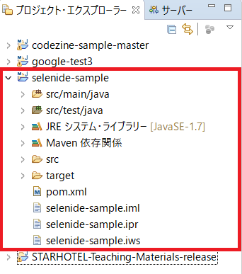
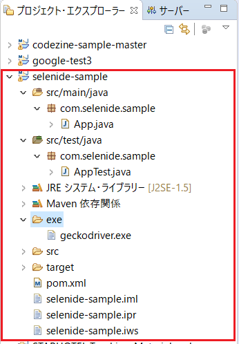

# Selenide入門

Seleniumラッパーの１つであるSelenideの環境構築手順とGitHubに公開されているサンプルコードの実行について書いていく。


## 前提条件

- EclipseでJavaのコードを作成し実行できる環境が整っていること
  - まだこの環境を構築していない場合は、[こちらのサイト](https://github.com/funakosi/programming/blob/master/selenium/Eclipse%E3%81%A7Selenium%20(%E5%88%9D%E6%AD%A9%E3%81%AE%E5%88%9D%E6%AD%A9).md)等を参考に構築しておくこと
  - 必須ではないが、Seleniumの基本的な動作方法を把握していること
    こちらも上で紹介したリンクに記載済なので、一通り目を通し確認しておくこと
- 実行環境は、Windows10
- FireFoxでテストするため、FireFoxをインストールしておくこと


## Mavenで Hello World

Mavenをインストールし各種設定を行う。この手順は「[【超初心者向け】Maven入門](https://qiita.com/tarosa0001/items/e5667cfa857529900216)」に詳しく解説されているので、ここでは概要だけを書いておく。

1. Mavenのインストール

2. パスを通す
   Mavenをインストール（保存）した場所へのパスを通す
3. ローカルリポジトリの設定
4. Eclipseの設定
   Mavenプラグインが既にインストールされている場合は確認程度でよい
5. MavenでHello World


## サンプルソースを動作

ここでは、日本Seleniumユーザコミュニティが提供している[テスト用のサイト](http://www.selenium.jp/test-site)を対象に作成されたサンプルソースで、GitHubに公開されているものをローカルにダウンロードし動作させてみる。

なおこのサンプルソースは、[エキスパートが教える Selenium最前線]([https://www.amazon.co.jp/%E3%82%A8%E3%82%AD%E3%82%B9%E3%83%91%E3%83%BC%E3%83%88%E3%81%8C%E6%95%99%E3%81%88%E3%82%8BSelenium%E6%9C%80%E5%89%8D%E7%B7%9A-CodeZine-Digital-First-%E6%88%B8%E7%94%B0/dp/479815752X](https://www.amazon.co.jp/エキスパートが教えるSelenium最前線-CodeZine-Digital-First-戸田/dp/479815752X))という書籍で紹介されているものであるため、詳細を確認したい場合には、そちらを参照すること。

### 1. GitHubからサンプルソースを取得

- 公開されている[GitHubのリポジトリ](https://github.com/shimashima35/codezine-sample)からコードを取得
  - ZIP形式でも `git clone`でもどちらでも良い

### 2. 取得したコードをEclipseのワークスペースに保存

- zip形式で取得した場合は、適当な場所に解凍する
- フォルダをEclipseのワークスペースに保存

### 3. Eclipseにインポート

- Eclipseを起動し、メニューのファイル > インポート
- インポートウィザードから Maven > 既存Mavenプロジェクトを選択し次へ
- ルートディレクトリに先ほど保存したワークスペースフォルダ内にある「codezine-sample-master」を指定し完了（プロジェクトエクスプローラーには下のように表示される）


- プロジェクトに「geckodriver.exe」を登録する
  - ドライバ保存用のフォルダ「exe」を作成しておく
  - [mozillaが公開しているサイト](https://github.com/mozilla/geckodriver)からドライバを取得
  - geckodriver.exe を上の exe フォルダにドラッグ＆ドロップでコピーする
  - 結果以下のようになる


### 4. 動作確認

３．でインポートしたサンプルコードを実行し、動作確認を行う。

- 実行する前に geckoドライバーのパスを指定する
  

[修正前]

```java
	@Before
    public void before(){
        Configuration.browser = WebDriverRunner.GECKO;
        //Configuration.browser = "edge";
        System.setProperty("webdriver.gecko.driver","/PATH/TO/geckodriver.exe");
    }
```
[修正後]

```java
    @Before
    public void before(){
        Configuration.browser = WebDriverRunner.GECKO;
        //Configuration.browser = "edge";
        System.setProperty("webdriver.gecko.driver","exe/geckodriver.exe");
    }
```


- Eclipse > codezine-sample-master > src/test/java > com.example.selenide > SampleTest.java を右クリック > 実行 > JUnitTest をクリック
- コンソール画面には赤字で大量にログが表示されるが必ずしもエラーというわけではないのでしばらく待つ
- 正常に処理がすすめば、自動でFireFoxが起動し、実装されているJUnitのテストを順番に実施していく
- 処理結果は、JUnitタブで確認できる

  - 正常系確認のテストでエラーとなっている。これは過去日付を指定しているのが原因。
  - 適当な未来日付を指定し、アサーションの箇所（assertThat）も修正する

[修正後]

```java
    @Test
    public void 正常系確認() {
        InputPage inputPage = open("http://example.selenium.jp/reserveApp/", InputPage.class);
        inputPage.setReserveYear("2019");
        inputPage.setReserveMonth("10");
        inputPage.setReserveDay("6");
        inputPage.setReserveTerm("2");
        inputPage.setBreakfastOn();
        inputPage.setGuestName("東京太郎");
        inputPage.setPlanA(false);
        inputPage.setPlanA(false);
        CheckInfoPage checkPage = inputPage.clickGotoNext();
        assertThat(checkPage.getErrorCheckResult(), is(""));
        assertThat(checkPage.getDateFrom(), is("2019年10月6日"));
        assertThat(checkPage.getDateTo(), is("2019年10月8日"));
        assertThat(checkPage.getDaysCount(), is("2"));
        assertThat(checkPage.getHeadcount(), is("1"));
        assertThat(checkPage.getBfOrder(), is("あり"));
        assertThat(checkPage.getGuestName(), is("東京太郎"));
        assertThat(checkPage.getPrice(), is("17750"));
        FinalConfirmPage finalPage = checkPage.doCommit();
        assertThat(finalPage.getErrorCheckResult(), is(""));
    }
```

- コスト算出については「[こちら](https://github.com/SoftwareTestAutomationResearch/STARHOTEL-Teaching-Materials/blob/release/docs/TestCase.pdf)」を参照

## 最初から作ってみる

mvnコマンドとEclipseを併用して、１からプロジェクトを作成してみる。

### 1. プロジェクトの作成

- mvnコマンドを使用してプロジェクトを作成する
- コマンドプロンプトで事前にEclipseのワークスペースフォルダに移動しておき、mvnコマンドを使用してプロジェクトを作成する。途中で何度か入力を促されるが、全部エンター押下で構わない。

```
$ mvn archetype:generate -DgroupId=com.selenide.sample -DartifactId=selenide-sample
(ログ省略)
[INFO] ------------------------------------------------------------------------
[INFO] BUILD SUCCESS
[INFO] ------------------------------------------------------------------------
[INFO] Total time:  01:20 min
[INFO] Finished at: 2019-09-13T15:38:47+09:00
[INFO] ------------------------------------------------------------------------
$
$ cd selenide-sample
$ mvn idea:idea
```


### 2.Eclipseでインポート

- Eclipseを起動しインポート
  - ファイル > インポート > 既存 Mavenプロジェクト > 次へ
  - 上で作成したプロジェクトのパスを指定 > 完了





### 3.Eclipseの設定

#### Selenideを使用できるようにする

- pom.xml の編集
  - dependencies に selenideを追加

[編集前（抜粋）]

```xml
  <dependencies>
    <dependency>
      <groupId>junit</groupId>
      <artifactId>junit</artifactId>
      <version>4.11</version>
      <scope>test</scope>
    </dependency>
  </dependencies>

```

[編集後（抜粋）]

```xml
  <dependencies>
    <dependency>
      <groupId>junit</groupId>
      <artifactId>junit</artifactId>
      <version>4.11</version>
      <scope>test</scope>
    </dependency>
    <dependency>
        <groupId>com.codeborne</groupId>
        <artifactId>selenide</artifactId>
        <version>4.9.1</version>
    </dependency>
```

- 編集後に保存する

#### Javaコンパイラを1.5に変更

1. プロジェクトを選択
2. コンテキストメニューから[プロパティ]を選択
3. [Javaのビルドパス]を選択
4. [ライブラリ]タブを選択
5. 一覧[ビルドパス上のJARおよびクラスフォルダ]から[JREシステムライブラリ]を選択し[編集]をクリック
6. システムライブラリから変更を行う

#### Driverの設定

- サンプルそーうを動作させたときと同様に、exe フォルダを作成し、そこに`geckodriver.exe` をコピー





### 4. コードの作成

- デフォルトで App.java と AppTest.java が出来ているが、これはテスト用で使用するもののとして、別途ソースファイルを作成する
- src/test/java以下のcom.selenide.sample を右クリック > 新規 > クラス
  - 名前：SampleTest

- コードの作成
  - エラーが出ている場合は、そのエラー箇所（赤い波線が表示されている所）にマウスをあてると対処法が表示されます（～をインポートします等）ので、適宜対応していく

```java
package com.selenide.sample;

import org.junit.Test;

import com.codeborne.selenide.Configuration;
import com.codeborne.selenide.Selenide;
import com.codeborne.selenide.WebDriverRunner;

public class SampleTest {

	@Test
	public void OpenSelenideSite() {
		 Configuration.browser = WebDriverRunner.FIREFOX;
	     final String PATH = "exe/geckodriver.exe";
	     System.setProperty("webdriver.gecko.driver", PATH);

	     Selenide.open("http://selenide.org");
	}
}
```


### 5. 動作確認

- ソースコード上で右クリック > 実行 > JUnitテスト をクリック

  - もしくはコマンドプロンプトでプロジェクトフォルダ内に移動した後 `mvn test`としてもテストは実行される

  - `mvn test`だと全てのテストが実行されるので、上で作成したテストだけを実行したい場合には以下のようにコマンドを入力し実行する

    ```
    $ mvn test -Dtest=SampleTest#OpenSelenideSite
    ```

- FireFoxが起動し、Selenideのサイトへ遷移後に閉じる


