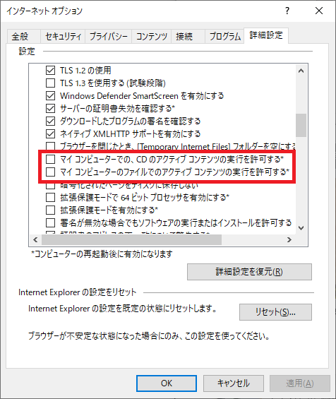

# SeleniumでIE11を操作

- seleniumでIEを操作する場合、他のブラウザと違って一手間かかります
- 設定内容については検索すれば色々と出てくるが、[seleniumQuery and IE Driver](https://github.com/seleniumQuery/seleniumQuery/wiki/seleniumQuery-and-IE-Driver)このサイトのトラブルシューティングが一番よくまとまっているので、その説明（英語）をラフに日本語に訳してみる


## IEドライバのトラブルシューティング

繰り返しになりますが、この説明は「[seleniumQuery and IE Driver](https://github.com/seleniumQuery/seleniumQuery/wiki/seleniumQuery-and-IE-Driver)」の軽い和訳になります。

### IEドライバ起動時に保護モードの例外が表示

表示されるメッセージは

>Unexpected error launching Internet Explorer. Protected Mode must be set to the same value (enabled or disabled) for all zones.

もしくは

>org.openqa.selenium.remote.SessionNotFoundException: Unexpected error launching Internet Explorer. Protected Mode settings are not the same for all zones. Enable Protected Mode must be set to the same value (enabled or disabled) for all zones. (WARNING: The server did not provide any stacktrace information)

以下、解決策

- IEの設定を変更
  - ツール＞インターネットオプション＞セキュリティで各ロケーションの保護モードを統一する

```
チェックオンでもオフでもいいので統一する必要があるらしい。僕の環境ではチェックオンで動かすことが出来た。
```


もしセキュリティレベルを変更できない場合の対処法

```java
System.setProperty("webdriver.ie.driver", IEDriverLocation);
DesiredCapabilities ieCapabilities = DesiredCapabilities.internetExplorer();
ieCapabilities.setCapability(InternetExplorerDriver.INTRODUCE_FLAKINESS_BY_IGNORING_SECURITY_DOMAINS, true);
WebDriver ieDriver = new InternetExplorerDriver(ieCapabilities);
$.driver().use(ieDriver);
//これは試してみたのですが、僕の環境ではうまいこと動作せず。
```


### 拡大率に関するエラー

以下のようなエラーが表示される場合

>org.openqa.selenium.remote.SessionNotFoundException: Unexpected error launching Internet Explorer. Browser zoom level was set to 75%. It should be set to 100% (WARNING: The server did not provide any stacktrace information)

簡単な解決策は、IEを起動して拡大率を100％にすること。

```
#補足
IEの拡大率を変更しても、その後Windowsのデスクトップの拡大率を変更してしまうと同様のエラーになる。したがって最も確実なのは、Windowsのデスクトップ拡大率を100％にした後にIEの拡大率が100％になっているかを確認することだと思う。
```

以下のように拡大率を無視するようなオプションを指定しドライバを自作する方法もある。

```java
System.setProperty("webdriver.ie.driver", IEDriverLocation);
DesiredCapabilities caps = DesiredCapabilities.internetExplorer();
caps.setCapability("ignoreZoomSetting", true);
WebDriver ieDriver = new InternetExplorerDriver(caps);
$.driver().use(ieDriver);
```


### ブラウザを取得できない

以下のようなエラーが表示され、ドライバがオフになってしまう。

> org.openqa.selenium.NoSuchWindowException: Unable to get browser (WARNING: The server did not provide any stacktrace information)

上記した保護モードの設定が出来ているか確認しましょう。

それでも解決しない場合には、[Required Configuration](https://github.com/SeleniumHQ/selenium/wiki/InternetExplorerDriver#required-configuration) に書かれている内容に準拠しているか確認する。


### NoSuchWindowException: Currently focused window has been closed.

（ウィンドウが閉じていいないにも関わらず）以下のようなエラーが表示される

> Exception in thread "main" org.openqa.selenium.NoSuchWindowException: Currently focused window has been closed.

まずは、上記した保護モードの設定を行っているか確認する。

また、[Required Configuration](https://github.com/SeleniumHQ/selenium/wiki/InternetExplorerDriver#required-configuration) に書かれていることを確認する。

最後に以下のポイントも確認する。

> - For IE 11 only, you will need to set a registry entry on the target computer so that the driver can maintain a connection to the instance of Internet Explorer it creates. For 32-bit Windows installations, the key you must examine in the registry editor is `HKEY_LOCAL_MACHINE\SOFTWARE\Microsoft\Internet Explorer\Main\FeatureControl\FEATURE_BFCACHE`. For 64-bit Windows installations, the key is `HKEY_LOCAL_MACHINE\SOFTWARE\Wow6432Node\Microsoft\Internet Explorer\Main\FeatureControl\FEATURE_BFCACHE`. Please note that the `FEATURE_BFCACHE` subkey may or may not be present, and should be created if it is not present. Important: Inside this key, create a `DWORD` value named iexplore.exe with the value of `0`.

もし64ビットOSを使用しているなら、以下の内容のファイル（拡張子：.reg）を作成し実行する。

（慣れている人なら直接 regeditで追加するのもあり）

```
Windows Registry Editor Version 5.00

[HKEY_LOCAL_MACHINE\SOFTWARE\WOW6432Node\Microsoft\Internet Explorer\Main\FeatureControl\FEATURE_BFCACHE]
"iexplore.exe"=dword:00000000
```


### InvalidSelectorException: "The xpath expression ... cannot be evaluated or does notresult in a WebElement"

xpathを使っている場合でローカルファイルを扱うときに以下のような例外が表示される

> Internet Explorer restricted this webpage from running scripts or ActiveX controls.

以下の手順で解決する

- IE ＞ツール＞オプション＞詳細
- 以下の2つの項目のチェックをONに変更する

設定変更後IEを再起動する




## 検証用のプログラム作成

- プロジェクトから作成する

```
> mvn archetype:generate -DgroupId=com.example -DartifactId=operate-ie
> cd operate-ie
> mvn eclipse:eclipse
```

- Eclipseで今作成したプロジェクトをインポート
- pom.xmlの編集

```xml
<!-- コンパイラは1.8を使用 -->
<properties>
    <project.build.sourceEncoding>UTF-8</project.build.sourceEncoding>
    <maven.compiler.source>1.8</maven.compiler.source>
    <maven.compiler.target>1.8</maven.compiler.target>
</properties>
```

```xml
<!-- seleniumとselenideを使用,ログ関連も追加 -->
<dependencies>
    <dependency>
        <groupId>junit</groupId>
        <artifactId>junit</artifactId>
        <version>4.11</version>
        <scope>test</scope>
    </dependency>
    <dependency>
	    <groupId>org.seleniumhq.selenium</groupId>
	    <artifactId>selenium-java</artifactId>
	    <version>3.141.59</version>
	</dependency>
	<dependency>
        <groupId>com.codeborne</groupId>
        <artifactId>selenide</artifactId>
        <version>4.9.1</version>
    </dependency>
    <!-- ログのファサード -->
    <dependency>
        <groupId>org.slf4j</groupId>
        <artifactId>slf4j-api</artifactId>
        <version>1.7.25</version>
    </dependency>
    <!-- ログの実装 -->
    <dependency>
        <groupId>ch.qos.logback</groupId>
        <artifactId>logback-classic</artifactId>
        <version>1.2.3</version>
    </dependency>
    <!-- ログをファイルに出力する際に必要 -->
    <dependency>
        <groupId>net.logstash.logback</groupId>
        <artifactId>logstash-logback-encoder</artifactId>
        <version>5.3</version>
    </dependency>
    <!-- ログをjson形式で出力する際に必要 -->
    <dependency>
	    <groupId>com.fasterxml.jackson.core</groupId>
	    <artifactId>jackson-annotations</artifactId>
	    <version>2.10.3</version>
	</dependency>
  </dependencies>
```

- 以下は Seleniumを使用したコード
  - パラメータ化テストには、Parameterizedランナーを使用（コンストラクタでパラメータ受け取り）

```java
package com.example;

import static org.hamcrest.CoreMatchers.*;
import static org.junit.Assert.*;

import java.util.Arrays;
import java.util.Collection;

import org.junit.After;
import org.junit.Before;
import org.junit.Test;
import org.junit.runner.RunWith;
import org.junit.runners.Parameterized;
import org.junit.runners.Parameterized.Parameters;
import org.openqa.selenium.By;
import org.openqa.selenium.WebDriver;
import org.openqa.selenium.WebElement;
import org.openqa.selenium.firefox.FirefoxDriver;
import org.openqa.selenium.ie.InternetExplorerDriver;

import com.codeborne.selenide.WebDriverRunner;

@RunWith(Parameterized.class)
public class SeleniumSample {

	String browser;
	private  WebDriver driver = null;

	public SeleniumSample(String browser) {
		this.browser = browser;
	}

	@Parameters(name = "{0}")
	public static Collection<Object[]> data() throws Throwable {
        return Arrays.asList(new Object[][] {
            { WebDriverRunner.FIREFOX },
            { WebDriverRunner.INTERNET_EXPLORER }
        });
    }

	@Before
	public void setUp() {
		if (browser.equals(WebDriverRunner.FIREFOX)) {
			System.setProperty("webdriver.gecko.driver", "exe\\geckodriver.exe");
		    driver = new FirefoxDriver();
		} else if (browser.equals(WebDriverRunner.INTERNET_EXPLORER)) {
			System.setProperty("webdriver.ie.driver","exe/IEDriverServer.exe");
		    driver = new InternetExplorerDriver();
		}
	}

	@After
	public void tearDown() {
		driver.quit();
	}

	@Test
	public void 各種ブラウザでテスト() throws InterruptedException {
		driver.get("http://example.selenium.jp/reserveApp/");
	    WebElement reserveDay = driver.findElement(By.id("reserve_day"));
	    reserveDay.clear();
	    reserveDay.sendKeys("25");
	    driver.findElement(By.id("guestname")).sendKeys("山田　太郎");
	    driver.findElement(By.id("goto_next")).click();
	    driver.findElement(By.id("commit")).click();;
	    WebElement comment = driver.findElement(By.tagName("h1"));
	    assertThat(comment.getText(), is("予約を完了しました。"));
	    Thread.sleep(3000);
	}
}
```

- 以下はSelenideを使用したコード
  - パラメータ化テストには、Theoriesランナーを使用（メソッドでパラメータ受け取り）

```java
package com.example;

import static com.codeborne.selenide.Selenide.*;
import static org.hamcrest.CoreMatchers.*;
import static org.junit.Assert.*;

import org.junit.experimental.theories.DataPoint;
import org.junit.experimental.theories.Theories;
import org.junit.experimental.theories.Theory;
import org.junit.runner.RunWith;
import org.openqa.selenium.By;
import org.slf4j.Logger;
import org.slf4j.LoggerFactory;

import com.codeborne.selenide.Configuration;
import com.codeborne.selenide.WebDriverRunner;
import com.codeborne.selenide.ex.ElementNotFound;

@RunWith(Theories.class)
public class SelenideSample {

	//slf4j使用
	private final static Logger log = LoggerFactory.getLogger("TestLog");

	@DataPoint
	public static String browser1 = WebDriverRunner.FIREFOX;
	@DataPoint
	public static String browser2 = WebDriverRunner.INTERNET_EXPLORER;

	public SelenideSample() {
		//初期化
	}

	@Theory
	public void 各種ブラウザでテスト(String browser) {
		String PATH = "";
		if (browser.equals(WebDriverRunner.FIREFOX)) {
			Configuration.browser = WebDriverRunner.FIREFOX;
			PATH = "exe/geckodriver.exe";
		    System.setProperty("webdriver.gecko.driver", PATH);
		} else if (browser.equals(WebDriverRunner.INTERNET_EXPLORER)) {
			Configuration.browser = WebDriverRunner.INTERNET_EXPLORER;
		    PATH = "exe/IEDriverServer.exe";
		    System.setProperty("webdriver.ie.driver", PATH);
		}

		String method = new Object(){}.getClass().getEnclosingMethod().getName();
		try {
			open("http://example.selenium.jp/reserveApp/");
			$("#reserve_day").val("25");
			$("#guestname").val("山田　太郎");
			$("#goto_next").click();
			$("#commit").click();
			assertThat($(By.tagName("h1")).getText(),is("予約を完了しました。"));
			log.info("{}-{}..PASSED",method,browser);
			//log.info(method.concat(browser).concat("..passed"));
		} catch (ElementNotFound e) {
			log.info("{}-{}..FAILED",method,browser);
			//log.error(method.concat("..failed"));
			log.error(e.getLocalizedMessage());
			fail(e.getMessage());
		} finally {
			close();
		}
	}
}
```

- コードはGitHubにあげてます
  - https://github.com/funakosi/operate-ie